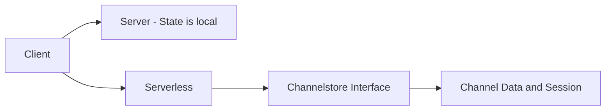

<details>

<summary>This post was co-written by AI research</summary>

Real-time communication is a cornerstone of modern web apps—from live chats and collaborative tools to instant notifications. WebSockets have emerged as the go-to solution for these use cases, enabling persistent, two-way connections between clients and servers ([The WebSocket API (WebSockets) - Web APIs | MDN](https://developer.mozilla.org/en-US/docs/Web/API/WebSockets_API#:~:text=The%20WebSocket%20API%20makes%20it,the%20server%20for%20a%20reply)). However, implementing WebSockets in **serverless** environments (like AWS Lambda or Cloudflare Workers) can be challenging due to their stateless nature ([How I implemented WebSocket API Gateway with AWS Lambda](https://tsh.io/blog/implementing-websocket-with-aws-lambda-and-api-gateway/#:~:text=The%20answer%20is%20simple,to%20send%20messages%20to%20them)). This is where **Pikku** comes in. In this post, we’ll explore WebSocket fundamentals, examine the hurdles of using WebSockets on Cloudflare and AWS, and see how Pikku’s hybrid approach makes running WebSocket channels effortless across serverless *and* traditional servers.

## Introduction to WebSockets

**WebSockets** are a protocol that provides a full-duplex (two-way) communication channel over a single, long-lived connection. Unlike HTTP, which follows a request-response pattern, a WebSocket connection stays open, allowing the server to push data to the client at any time and the client to send messages to the server as needed ([How I implemented WebSocket API Gateway with AWS Lambda](https://tsh.io/blog/implementing-websocket-with-aws-lambda-and-api-gateway/#:~:text=The%20WebSocket%20API%20is%20a,charts%2C%20or%20even%20gaming%20platforms)). This eliminates the need for constant polling and reduces latency, making WebSockets ideal for real-time features like chat applications, live dashboards, online games, and collaborative editing tools ([How I implemented WebSocket API Gateway with AWS Lambda](https://tsh.io/blog/implementing-websocket-with-aws-lambda-and-api-gateway/#:~:text=The%20WebSocket%20API%20is%20a,charts%2C%20or%20even%20gaming%20platforms)).

Once a WebSocket connection is established (after an initial HTTP handshake), both the client and server use a simple event-driven API to communicate:

- **Open**: Triggered when the connection is successfully opened. For example, in the browser you can listen for the `'open'` event (via `socket.onopen` or an event listener) to know the channel is ready ([WebSocket - Web APIs | MDN](https://developer.mozilla.org/en-US/docs/Web/API/WebSocket#:~:text=message)).
- **Message**: Fired whenever a message is received on the connection. You handle this with an `'onmessage'` event handler to process incoming data ([WebSocket - Web APIs | MDN](https://developer.mozilla.org/en-US/docs/Web/API/WebSocket#:~:text=message)). For instance, a chat app might display incoming chat messages in this handler.
- **Close**: Fired when the connection is closed, either intentionally or due to network issues. The `'onclose'` event lets you react to disconnections (e.g. cleaning up state or attempting reconnection) ([WebSocket - Web APIs | MDN](https://developer.mozilla.org/en-US/docs/Web/API/WebSocket#:~:text=close)).

These events (`open`, `message`, `close`) form the core of the WebSocket API and are supported in all modern browsers and frameworks. Under the hood, once `open` fires, either side can `send` data at will, and every `message` event carries that data for processing. This low-level simplicity is powerful—developers can build interactive, low-latency experiences on the web without the overhead of repeated HTTP requests ([The WebSocket API (WebSockets) - Web APIs | MDN](https://developer.mozilla.org/en-US/docs/Web/API/WebSockets_API#:~:text=The%20WebSocket%20API%20makes%20it,the%20server%20for%20a%20reply)).

## WebSockets in Cloudflare & AWS

Running WebSockets on a single server (or VM) is straightforward: the server process can hold many open connections in memory, and you maintain session state as long as the process lives. In **serverless environments** like AWS Lambda or Cloudflare Workers, it’s more complex. These platforms are designed to be **stateless** and ephemeral – they spin up instances on demand to handle events and then shut them down. But a WebSocket by definition is **stateful** and long-lived, which creates a mismatch ([How I implemented WebSocket API Gateway with AWS Lambda](https://tsh.io/blog/implementing-websocket-with-aws-lambda-and-api-gateway/#:~:text=The%20answer%20is%20simple,to%20send%20messages%20to%20them)).

Let’s consider **AWS (Amazon Web Services)** first. AWS offers WebSocket support via API Gateway, which keeps client connections open at the edge and triggers your Lambda functions on events (connect, message, disconnect). The challenge is that each Lambda invocation has no memory of any prior invocations. When a client sends a message, API Gateway calls a Lambda, which runs independently and then terminates. If you want to broadcast that message to other connected clients, how do you find them? The typical solution is to **persist connection info in a database**. For example, one common approach is storing active WebSocket connection IDs in DynamoDB (Amazon’s NoSQL database). On each message, the Lambda function will query the database for all connections (perhaps all users in a chat room), then loop through and call the API Gateway’s `postToConnection` API for each ID to push out the message ([Building serverless multi-Region WebSocket APIs | AWS Compute Blog](https://aws.amazon.com/blogs/compute/building-serverless-multi-region-websocket-apis/#:~:text=To%20that%20end%2C%20the%20function,message%20to%20the%20respective%20clients)) ([Building serverless multi-Region WebSocket APIs | AWS Compute Blog](https://aws.amazon.com/blogs/compute/building-serverless-multi-region-websocket-apis/#:~:text=The%20first%20target%20is%20a,where%20the%20message%20was%20received)). This works, but as you can imagine, it introduces complexity and latency – you’re effectively bolting statefulness onto a stateless architecture. In short, **AWS developers must implement their own connection registry** (often DynamoDB or another store) to track who’s connected and store session data ([How I implemented WebSocket API Gateway with AWS Lambda](https://tsh.io/blog/implementing-websocket-with-aws-lambda-and-api-gateway/#:~:text=The%20answer%20is%20simple,to%20send%20messages%20to%20them)). Managing disconnects (removing stale IDs) and scaling that database for many connections are additional hurdles.

Now onto **Cloudflare Workers**. Cloudflare allows code to run at the edge, closer to users, and it recently added support for WebSockets. A Cloudflare Worker can act as a WebSocket server, but since Workers are also designed to be event-driven and short-lived, Cloudflare introduced **Durable Objects** to handle stateful needs. A Durable Object is essentially a single-threaded, stateful instance that can be used to coordinate data or hold state between events. In practice, when using WebSockets on Cloudflare, you often delegate the WebSocket handling to a Durable Object that will accept connections and manage messages. This Durable Object becomes a **single point of coordination** for a given set of clients (for example, all clients in a chat room connect to the same Durable Object) ([Using WebSockets · Cloudflare Durable Objects docs](https://developers.cloudflare.com/durable-objects/best-practices/websockets/#:~:text=WebSockets%20are%20long,when%20combined%20with%20Durable%20Objects)) ([Using WebSockets · Cloudflare Durable Objects docs](https://developers.cloudflare.com/durable-objects/best-practices/websockets/#:~:text=Because%20Durable%20Objects%20provide%20a,using%20Durable%20Objects%20with%20WebSockets)). The Durable Object can keep track of connected sockets, broadcast messages, and maintain any per-connection session data, all within the Cloudflare edge network. Cloudflare even offers a **WebSocket Hibernation** feature – if a Durable Object has no activity, it can hibernate (persist state and free resources) while keeping the connections alive, and wake up when needed ([Pikku has gone serverless  | Pikku](https://pikku.dev/blog/2024/12/23/pikku-goes-serverless#:~:text=Last%20but%20definitely%20not%20least%3A,external%20database%20like%20on%20AWS)). This is great for cost savings, but it underscores how **non-trivial** WebSockets can be in a serverless model – you need special mechanisms to avoid holding compute instances open 24/7.

**In summary**, implementing WebSockets in AWS or Cloudflare serverless environments means dealing with state in a place that doesn’t naturally have it. AWS developers struggle with external data stores to track connections ([How I implemented WebSocket API Gateway with AWS Lambda](https://tsh.io/blog/implementing-websocket-with-aws-lambda-and-api-gateway/#:~:text=The%20answer%20is%20simple,to%20send%20messages%20to%20them)), and Cloudflare developers leverage Durable Objects to manage state and concurrency ([Using WebSockets · Cloudflare Durable Objects docs](https://developers.cloudflare.com/durable-objects/best-practices/websockets/#:~:text=WebSockets%20are%20long,when%20combined%20with%20Durable%20Objects)). These solutions work, but require extra infrastructure and careful architecture. Wouldn’t it be nice if you could write your real-time logic without worrying about *how* it persists across function invocations or scales at the edge? **That’s exactly the gap Pikku aims to bridge.**

## How Pikku Bridges the Gap

**Pikku** is a function-first TypeScript framework that takes a hybrid approach to WebSockets, letting you run real-time channels on both serverless platforms and traditional servers with minimal changes. Pikku provides an abstraction called **Channels** (its WebSocket support) that decouples your application logic from the underlying WebSocket implementation. In essence, you write your WebSocket handlers (connect, message, disconnect, etc.) once, and Pikku adapts them to the environment you deploy on – whether it’s a Node.js server, AWS API Gateway + Lambda, Cloudflare Workers, or anything in between ([Announcing Pikku 0.6: WebSockets, Scheduled Tasks, and a More Flexible, Typed Future | Pikku](https://pikku.dev/blog/2024/12/13/pikku-0.6#:~:text=This%20approach%20keeps%20your%20real,plug%20in%20the%20right%20adapter)).

One of Pikku’s key innovations for serverless support is the **`channelstore`**. The channel store is a built-in mechanism to persist WebSocket connections and associated user sessions outside of any single runtime instance. This means when a user connects via WebSocket, Pikku can record that connection (and any session data you attach to it) in a durable store. Later, if another serverless function instance needs to send a message to that user, it can retrieve the connection from the channel store and route the message appropriately. Practically, the channel store might be backed by different technologies depending on the platform: for example, in AWS you could use DynamoDB or an SQL database (Pikku’s AWS example uses PostgreSQL as a channel store) ([Pikku has gone serverless  | Pikku](https://pikku.dev/blog/2024/12/23/pikku-goes-serverless#:~:text=This%20is%20also%20powered%20by,stores%20in%20the%20next%20release)), while on Cloudflare, a Durable Object can serve as the channel store (maintaining connections in-memory with persistence via Cloudflare’s infrastructure) ([Pikku has gone serverless  | Pikku](https://pikku.dev/blog/2024/12/23/pikku-goes-serverless#:~:text=Last%20but%20definitely%20not%20least%3A,external%20database%20like%20on%20AWS)). The beauty of Pikku’s approach is that as a developer, **you don’t have to manually implement all this plumbing** – Pikku provides the interface and helpers to handle storing and retrieving connections.

Here’s how it works in practice: Suppose a client connects to your Pikku WebSocket channel. In your Pikku `onConnect` handler, you might authenticate the user and call `userSession.set({ userId: 'Bob' })`. Under the hood, Pikku will ensure that this session data (“userId: Bob”) is saved in the channel store *against that specific WebSocket connection*. If you’re on a serverless platform, that means even if the next message from Bob is handled by a fresh function instance (with no memory of Bob), Pikku will fetch Bob’s session from the store and know that this connection is associated with user Bob. Similarly, if you want to broadcast a message to all users in a certain group, Pikku can query the channel store for all active connections in that group and send out the messages, regardless of which physical instance those connections are attached to. This effectively **mimics the convenience of in-memory WebSocket servers** (where you have a list of connections readily available) while operating on stateless serverless infrastructure.

Crucially, Pikku’s channel abstraction doesn’t lock you into one environment. You could run your Pikku app on a single Node.js server with a WebSocket library like `ws` or `uWebSockets.js` during development or for an on-prem deployment. Later, if you decide to move to AWS for scalability, you can deploy the same code with an AWS adapter and a DynamoDB/Postgres channel store with minimal changes ([Announcing Pikku 0.6: WebSockets, Scheduled Tasks, and a More Flexible, Typed Future | Pikku](https://pikku.dev/blog/2024/12/13/pikku-0.6#:~:text=This%20approach%20keeps%20your%20real,plug%20in%20the%20right%20adapter)). Pikku will handle wiring your channel events to AWS API Gateway and use the configured channel store to keep everything in sync. Likewise, you could deploy the same service to Cloudflare Workers – Pikku will use Cloudflare’s WebSocket server + Durable Object behind the scenes. This flexibility is the hallmark of Pikku’s hybrid approach: **write once, run anywhere** for WebSockets. It bridges the gap by providing the state management layer (sessions + connection persistence) and a uniform API for real-time events, so developers can focus on the application logic instead of the intricacies of each cloud’s WebSocket quirks.

## Key Benefits of Pikku

Pikku’s approach to WebSocket channels brings several compelling benefits to developers:

- **Hybrid Architecture (Serverless + Traditional)** – Pikku enables truly hybrid deployments. You can run WebSocket channels in a serverless environment (AWS Lambda, Cloudflare Workers, etc.) *or* on a traditional server/VM with the **same codebase** ([Announcing Pikku 0.6: WebSockets, Scheduled Tasks, and a More Flexible, Typed Future | Pikku](https://pikku.dev/blog/2024/12/13/pikku-0.6#:~:text=This%20approach%20keeps%20your%20real,plug%20in%20the%20right%20adapter)). This means you aren’t forced to choose between the convenience of serverless and the stability of a dedicated server; Pikku lets you have both. For example, develop and test locally on a Node.js server with an in-memory WebSocket, then deploy to AWS without rewriting your real-time logic. The framework’s abstractions ensure your `onConnect`, `onMessage`, and other handlers behave consistently across environments. Switching from one runtime to another is as simple as plugging in the appropriate adapter, with no overhaul of your application code ([Announcing Pikku 0.6: WebSockets, Scheduled Tasks, and a More Flexible, Typed Future | Pikku](https://pikku.dev/blog/2024/12/13/pikku-0.6#:~:text=This%20approach%20keeps%20your%20real,plug%20in%20the%20right%20adapter)). This hybrid capability protects your investment in code and gives you freedom to use the architecture that fits your needs (or even a mix of both).

- **Deployment Flexibility with Multiple WebSocket Implementations** – Whether you prefer the simplicity of the popular Node.js `ws` library, the high performance of `uWebSockets.js (uWS)`, or you’re using cloud-specific implementations like AWS API Gateway WebSockets or Cloudflare’s Workers/Durable Objects, Pikku has you covered. It is **transport-agnostic**, meaning your WebSocket channel logic is not tied to a specific server or library. Pikku provides adapters for major runtimes and WebSocket engines ([Pikku - A Function-First Framework for Node.js | Pikku](https://pikku.dev/#:~:text=Deploy%20Anywhere%2C%20Integrate%20Seamlessly)). For instance, you can use the Express or Fastify adapter for HTTP and pair it with `ws` for WebSockets, or use Pikku’s integration with uWS for a blazing-fast server. In serverless, the AWS adapter knows how to handle API Gateway WebSocket events, and the Cloudflare adapter uses the edge network. This flexibility simplifies deployment pipelines — you can confidently deploy Pikku on AWS, Azure, Cloudflare, or even inside Docker containers, knowing the WebSocket pieces will just work. No more writing custom glue code for each provider or worrying that your WebSocket library isn’t supported on platform X. Pikku abstracts those differences away ([Announcing Pikku 0.6: WebSockets, Scheduled Tasks, and a More Flexible, Typed Future | Pikku](https://pikku.dev/blog/2024/12/13/pikku-0.6#:~:text=,WebSocket%20environments%20without%20painful%20rewrites)), allowing you to focus on your app’s real-time features instead of low-level compatibility issues.

- **TypeScript Support & Auto-Generated Client** – Pikku is built with **TypeScript** at its core, which means you get static type checking and intellisense for your WebSocket messages and data structures. When you define a channel and the types of messages it sends or receives, Pikku leverages that to ensure type safety end-to-end. Even more impressive: Pikku can **automatically generate a client library** for your channels ([Pikku - A Function-First Framework for Node.js | Pikku](https://pikku.dev/#:~:text=%2A%20,Clients)). This client is a tiny TypeScript/JavaScript module that knows how to connect to your WebSocket channel and has methods for each message type or action you define. For example, if you have a channel where clients can send a `{action: "join", roomId: 123}` message and receive a `"welcome"` event, the auto-generated client will have the corresponding methods/types to send and handle those properly. Developers no longer need to write repetitive front-end WebSocket code or manually keep client-server message contracts in sync. The generated client is fully-typed, so if you change a data format on the server, your front-end code will catch the mismatch at compile time. This **tight coupling of front-end and back-end types** eliminates an entire class of bugs and makes building real-time features much more ergonomic. In short, Pikku treats WebSockets as first-class citizens in the TypeScript world, bringing the kind of productivity and safety that developers typically enjoy with REST/HTTP (through OpenAPI, etc.) to the realm of WebSockets.

Each of these benefits on its own is valuable, but together they make Pikku a **game-changer for WebSocket development** in cloud environments. You get the real-time responsiveness users crave, without the usual DevOps headache of maintaining stateful servers or the fear that serverless will complicate your design. Pikku handles the heavy lifting under the hood – from connection persistence to client generation – so you can deliver interactive features faster and with confidence.

## Conclusion and Call to Action

WebSockets no longer have to be a black box of state management hacks or provider-specific code. With Pikku’s hybrid architecture and channel store magic, you can build real-time channels that **just work**, whether you’re on AWS, Cloudflare, or a classic server setup. We’ve seen how the framework abstracts the nuances of WebSocket events and session persistence across environments, letting you write clean, expressive TypeScript functions for your real-time logic. The result is less boilerplate, fewer edge-case bugs, and a more enjoyable developer experience when tackling features like live chats, IoT feeds, or multiplayer games.

**Ready to try Pikku for yourself?** The best way to appreciate its simplicity is to see it in action. Head over to the Pikku documentation and get started with a quick tutorial, or spin up the Pikku starter project (which includes examples for AWS and Cloudflare) to deploy a WebSocket channel in minutes. Give Pikku a spin in your next project and experience how effortless real-time web development can be. With Pikku handling your WebSockets, you can focus on building awesome features — and let the framework bridge the gap between serverless scale and real-time state. Happy coding, and welcome to the future of WebSocket development with Pikku!
</details>

# Bridging the Gap: Real-Time WebSocket Channels with Pikku

Real-time applications—from live chats and collaborative tools to gaming and IoT dashboards—rely on persistent, two-way communication. WebSockets provide this vital connection, yet building and scaling WebSocket channels across serverless environments (like AWS or Cloudflare) and traditional servers can be challenging. **Pikku** bridges this gap with its hybrid architecture and a powerful API set: **onConnect**, **onMessage**, **onDisconnect**, and **addChannel**.

One of Pikku’s standout features is its built-in sync/async **channelstore interface**. This flexible interface isn’t tied to any specific datastore—it can be implemented against any desired backend (be it a SQL database, NoSQL store, or even Cloudflare Durable Objects). This means that whether you’re working in a serverless environment or on a traditional server, you have a consistent way to persist connection states and user sessions without being locked into one storage solution. 

## A Quick Dive into WebSockets

WebSockets keep the conversation open. Unlike HTTP’s strict request–response model, they maintain an open connection, allowing both client and server to send data at any time. This is managed by a few key events:

- **onConnect**: Triggered when a client connects—ideal for authenticating users and initializing state.
- **onMessage**: Fires when a message is received, letting you process and route the data.
- **onDisconnect**: Called when the connection closes, ensuring resources are properly cleaned up.

Pikku bridges these events inside its **addChannel** API, making it easy to deploy the same logic anywhere—from a local server using `ws` or `uWebSockets.js` to serverless setups on AWS and Cloudflare.

### WebSocket Lifecycle Diagram


*Figure: The lifecycle of a WebSocket connection in Pikku.*

---

## Deep Dive: Pikku Channel APIs & onMessageRoute

Pikku’s intuitive API surface streamlines real-time communication. Its standout feature—**onMessageRoute**—is inspired by AWS’s native WebSocket routing. Much like how AWS API Gateway routes messages to dedicated Lambda functions based on custom route keys, onMessageRoute lets you define granular sub-routes under a common namespace.

Consider this simplified backend snippet:

```javascript
import { onConnect, onMessage, ... } from './events.functions.js'

addChannel({
  name: 'events',
  route: '/',
  // Called on Open
  onConnect,
  // Called on Close
  onDisconnect,
  // Whether a user session is required
  auth: true,
  onMessage,
  onMessageRoute: {
    // If payload has a key "action", it will forward to the correct handler
    action: {
      // Auth isn't needed for this message
      auth: { func: authenticate, auth: false },
      // We could add custom permissions for certain messages
      subscribe: { func: subscribe, permissions: {} },
      unsubscribe,
      emit: emitMessage,
    },
  },
})
```

**What’s happening here?**

- **addChannel** registers the channel and bundles your lifecycle functions.
- **onConnect/onDisconnect/onMessage** manage the core connection events.
- **onMessageRoute**—inspired by AWS’s routing mechanism—lets you define specific handlers (like `auth`, `subscribe`, etc.) for different actions. This modular approach makes your code clean, secure, and highly scalable.

---

## Leveraging the Auto-Generated Client on the Frontend

Pikku doesn’t just simplify backend logic; it also auto-generates a TypeScript-friendly client for your frontend. This means you get a fully typed, ready-to-use API that mirrors your backend channels without additional boilerplate.

`PikkuWebSocket` is a tiny wrapper ontop of `WebSocket` powered by types, which aren't included in the actual application. This keeps your realtime SDKs tiny!

A simplified frontend snippet might look like this:

```javascript
import { PikkuWebSocket } from '../pikku-websocket.gen.js'

const websocket = async (serverUrl, apiKey, userId, onClose) => {
  let authState = 'initial'
  const socket = new PikkuWebSocket('events', serverUrl, apiKey)

  socket.ws.onopen = async () => {
    console.log('WebSocket connected')

    // Subscribe to global messages.
    socket.subscribe((data) => console.log('Global message:', data))

    // Get the route for action-based messages.
    const route = socket.getRoute('action')
    route.subscribe('auth', async (data) => {
      authState = data.authResult ? 'authenticated' : 'unauthenticated'
      console.log(`Authentication ${authState}`)
    })

    // Send an auth message.
    route.send('auth', { token: 'valid', userId })

    // Wait for authentication to complete.
    while (authState === 'initial') {
      await new Promise(resolve => setTimeout(resolve, 100))
    }

    // Send other messages: subscribing and emitting.
    route.send('subscribe', { name: 'test' })
    route.send('emit', { name: 'test' })

    // Close the connection after a short period.
    setTimeout(() => {
      socket.ws.onclose = onClose
      socket.ws.close()
    }, 5000)
  }

  socket.ws.onerror = (e) => console.error('WebSocket error:', e)
}
```

**Key Points:**

- **Auto-Generated Client**: Enjoy a client that mirrors your backend channels exactly—no extra glue code required.
- **Type Safety**: With TypeScript, you get end-to-end type checking, ensuring client and server stay in sync.
- **Seamless Integration**: Build your demo or production app with the same confidence, whether you’re deploying on traditional servers or using serverless platforms.

For a complete working example—including support for `ws`, `uWS`, Cloudflare, and Lambda—check out the [Yarn Workspace Starter Repository](https://github.com/pikkujs/yarn-workspace-starter).

---

## WebSockets in the Cloud: AWS & Cloudflare

### AWS API Gateway & Lambda

- **Challenge**: AWS Lambda functions are ephemeral, making persistent WebSocket connections difficult. Developers often need external databases (like DynamoDB) to track connection state.
- **Pikku’s Solution**: Pikku leverages its built-in channelstore interface—which can be implemented against any datastore—to persist connection and session data. This means that even if a new Lambda instance handles the next message, it can retrieve the connection’s context seamlessly.

### Cloudflare Workers & Durable Objects

- **Challenge**: Cloudflare Workers, while powerful, are also stateless. Durable Objects help manage state, but the setup can be complex.
- **Pikku’s Solution**: The uniform API lets you write your WebSocket logic once. Whether using Durable Objects on Cloudflare or an external store on AWS, your code—powered by onConnect, onMessage, onDisconnect, and onMessageRoute—remains consistent.

### Hybrid Architecture Diagram



*Figure: Pikku’s provides a runLocalChannel and runServerless channel interface that normalizes user code without losing any performance when running locally.*

---

## The Power of Pikku

Pikku isn’t just another WebSocket library—it’s a comprehensive framework designed for today’s diverse deployment needs. Here’s why it stands out:

- **Hybrid Architecture**: Write your WebSocket logic once and deploy it anywhere—be it a Node.js server or a serverless environment like AWS/Cloudflare.
- **Deployment Flexibility**: With adapters for multiple WebSocket implementations, you can deploy on your platform of choice without rewriting your real-time logic.
- **AWS-Inspired onMessageRoute**: Modeled after AWS’s native WebSocket routing, this feature offers a modular, structured approach to handling various message actions.
- **Built-In Channelstore Interface**: Its channelstore isn’t hardwired to one solution. You can implement it against any desired datastore, making it incredibly flexible for any backend.
- **Robust TypeScript Support & Auto-Generated Client**: Enjoy static type checking and an auto-generated client that minimizes bugs and streamlines development.
- **Intuitive APIs**: With well-defined **onConnect**, **onMessage**, **onDisconnect**, and **addChannel** APIs, Pikku abstracts away the complexities of state management and connection handling, letting you focus on building engaging real-time features.

---

## Conclusion

Managing real-time WebSocket channels across diverse environments has traditionally been complex and error-prone. With Pikku’s hybrid architecture, AWS-inspired onMessageRoute, and a built-in channelstore interface that can be implemented against any datastore, building robust real-time applications becomes a breeze.

Ready to revolutionize your real-time apps?  
- **Explore the [Pikku documentation](https://pikku.dev/docs/channels/)** for in-depth details.
- **Dive into the [Yarn Workspace Starter Repository](https://github.com/pikkujs/yarn-workspace-starter)** for complete examples covering ws, uws, Cloudflare, and Lambda.

Harness the full potential of WebSockets with a framework that adapts to your deployment needs. With Pikku handling the heavy lifting, you can focus on delivering dynamic, engaging experiences to your users. Happy coding!
