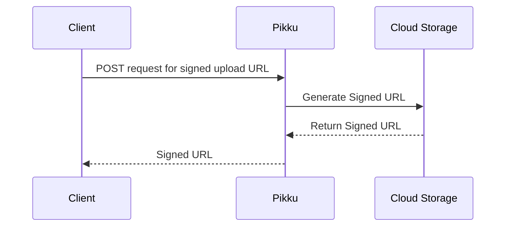
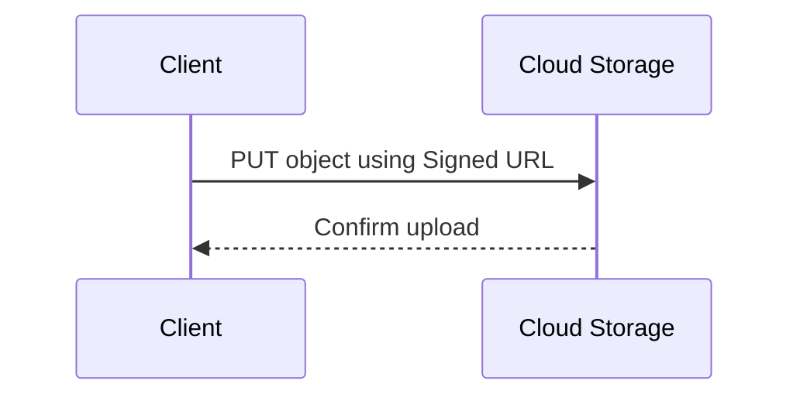
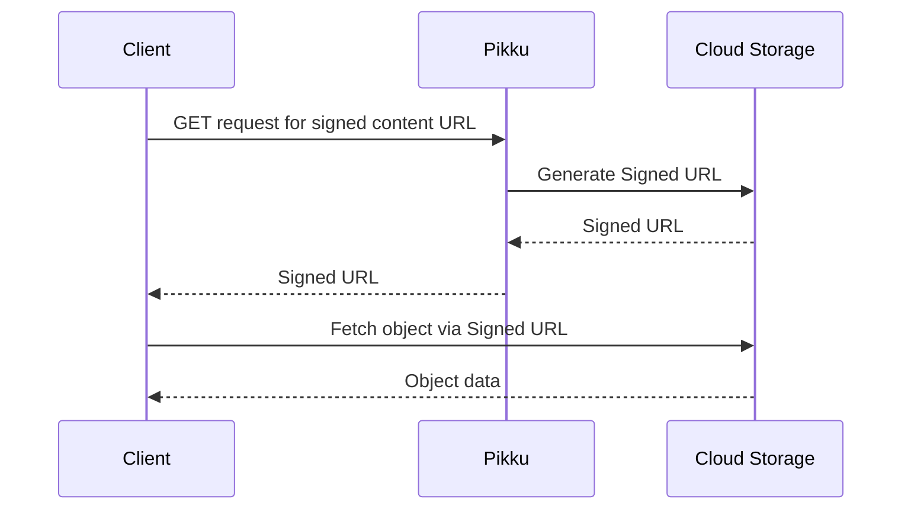
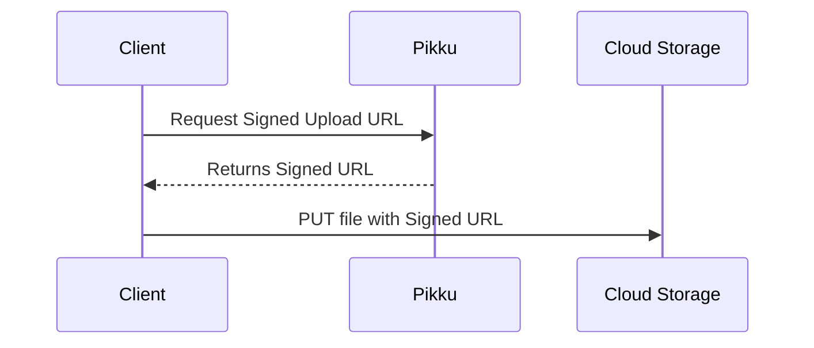
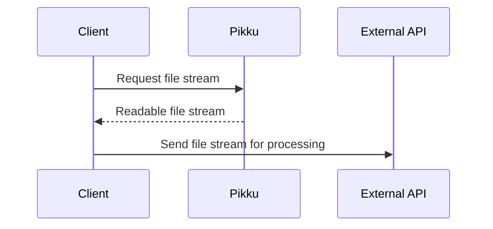

We're excited to walk you through how **content management** works in Pikku! Unlike traditional frameworks, Pikku deliberately delegates content handling—such as file uploads and downloads—to external platforms. This keeps Pikku lightweight, secure, and easy to integrate into your existing workflow.

<!-- truncate -->

## Why Pikku Delegates Content Management

Managing files directly inside your server framework can complicate deployments, introduce security risks, and bloat your application size. Pikku addresses this by:

- **Delegating file uploads/downloads** to specialized cloud providers (e.g., AWS S3, Azure Blob Storage).
- **Reducing library footprint** by excluding built-in file management.
- **Leveraging established tools** like Express middleware and cloud SDKs for handling content efficiently.
- **Keeping API services small and efficient** by avoiding the need to stream or buffer large files, which can dramatically increase memory and CPU usage.

## How Content Operations Typically Work

Secure content operations using signed URLs generally involve three steps:

### 1. Request a Signed Upload URL



### 2. Upload the Object Directly



### 3. Retrieve Content Securely with Signed URLs



## Pikku's ContentService Interface

At the heart of content management is the `ContentService` interface:

```typescript
export interface ContentService {
  /** Signs a content key to generate a secure, time-limited access URL. */
  signContentKey(contentKey: string, dateLessThan: Date, dateGreaterThan?: Date): Promise<string>;

  /** Signs an arbitrary URL to generate a secure, time-limited access URL. */
  signURL(url: string, dateLessThan: Date, dateGreaterThan?: Date): Promise<string>;

  /** Generates a signed URL for uploading a file directly to storage. */
  getUploadURL(fileKey: string, contentType: string): Promise<{ uploadUrl: string; assetKey: string }>;

  /** Deletes a file from the storage backend. */
  deleteFile(fileName: string): Promise<boolean>;

  /** Uploads a file stream to storage under a specified asset key. */
  writeFile(assetKey: string, stream: ReadStream): Promise<boolean>;

  /** Copies a file from a local absolute path into storage under a new asset key. */
  copyFile(assetKey: string, fromAbsolutePath: string): Promise<boolean>;

  /** Reads a file from storage as a readable stream. */
  readFile(assetKey: string): Promise<ReadStream>;
}
```

## Switching Between Local and Cloud Content Management

Pikku allows you to easily switch between a local or cloud-backed content service based on your environment:

```typescript
let content: ContentService = new LocalContent(config.content, logger);
if (isProduction) {
  content = new S3Content(
    {
      bucketName: `content.${config.domain}`,
      region: config.awsRegion,
    },
    logger,
    await secrets.getSecretJSON(config.secrets.content),
  );
}
```

This mirrors how most services in Pikku work: run locally for fast iteration, then switch automatically to managed services in production.  
*(If your cloud resources live inside a private VPC, you might need tunneling—blog post for another time!)*

## Adding HTTP Endpoints for Content Management

Uploading and signing files through Pikku requires simple endpoints:

```typescript
export const getSignedUploadUrl: APIFunction<{
  name?: string;
  contentType: string;
}, {
  uploadUrl: string;
  assetKey: string;
}> = async ({ content }, { name, contentType }, session) => {
  if (!name || name === 'uuid') {
    name = crypto.randomUUID();
  }
  const contentTypeSuffix = contentType.split('/').pop();
  const key = `${session.userId}/checkin/${name}.${contentTypeSuffix}`;
  return await content.getUploadURL(key, contentType);
};

export const getSignedContentUrls: APIFunctionSessionless<{ assetKeys: string[] }, string[]> = async ({ content }, data) => {
  return Promise.all(data.assetKeys.map(assetKey =>
    content.signContentKey(assetKey, new Date())
  ));
};

addRoute({
  method: 'post',
  route: '/content/upload-objects',
  func: getSignedUploadUrl,
});

addRoute({
  method: 'post',
  route: '/content/sign-content-key',
  func: getSignedContentUrls,
});
```

## Client-side Upload Example

On the frontend, uploading a file with a signed URL requires just the following:

```typescript
export const uploadFile = async ({ file }: { file: Blob }): Promise<string> => {
  const signedUrl = await pikkuFetch.post('/content/upload-objects', {
    contentType: file.type,
    size: file.size,
  });
  await fetch(signedUrl.uploadUrl, {
    method: 'PUT',
    body: file,
    headers: {
      'Content-Type': file.type,
      'Content-Disposition': 'inline',
    },
  });
  return signedUrl.assetKey;
};
```



*Pro tip:* You can customize this flow further by passing entity types or folder paths into your upload request to organize your storage structure!


## Bonus Example: Streaming Content to External APIs

Pikku's `ContentService` also makes it simple to integrate file streams directly into external APIs within functions:

```typescript
const transcribeAudioFile: APIFunction<{ audioSrc: string }, { transcription: string }> = async ({ content, openai }, { audioSrc }) => {
  const audioFileStream = await content.readFile(audioSrc);
  const transcription = await openai.audio.transcriptions.create({
    file: audioFileStream,
    model: 'whisper',
    response_format: 'text',
  });
  return { transcription };
};
```



This allows you to manage content efficiently across any service without changing your core application code.

## Wrapping Up

By delegating content management to external platforms, Pikku stays lightweight, secure, and highly flexible.  
Your API services remain fast and resilient—and your cloud storage stays organized, scalable, and secure.

We hope this gives you a clear insight into how content operations work in Pikku.  
Try it out in your projects and let us know how it helps simplify your workflow!
