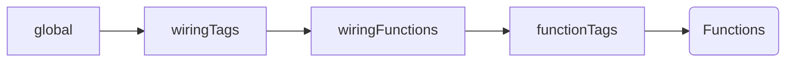

Pikku 0.9 is a clarity release. Fewer naming footguns, explicit RPC exposure, transport-wide tagging for middleware/permissions, and early interaction objects that make non-HTTP middleware practical. It also refactors the HTTP router to make **swapping strategies feasible next**, though that toggle isn’t user-facing yet.

> tl;dr: predictable names, safer RPC boundaries, and a single tag‑driven model for cross‑cutting concerns across HTTP, channels, queues and scheduled tasks.

<!-- truncate -->`


# Highlights

## 1) Consistent wiring names

Pikku now uses a consistent “wireX” shape across transports. Concretely:

```ts
// HTTP
wireHTTP({ method: 'get', route: '/health', func: healthCheck })

// WebSockets / channels
wireChannel({ 
  name: 'chat', 
  onOpen: joinChat, 
  onMessage: handleChatMessage 
})

// Queues
wireQueueWorker({ queueName: 'thumbnail', func: generateThumbnail })

// Scheduled tasks
wireScheduledTask({ schedule: '0 * * * *', name: 'hourlyReindex', func: reindex })

// MCP
wireMCPTool({ name: 'disableTool', description: 'Disable a tool by name', func: disableTool })
```

Note:

- There is **no** `wireRPC(...)`. RPC exposure is controlled per function (see section 4).

---

## 2) Naming: `pikkuPermission` and `pikkuMiddleware`
Standardized constructors bring consistency without losing type safety:

```ts
export const requireOwner = pikkuPermission<{ todoId: string }>(
  async ({ todoService }, { todoId }, session) => {
    const { ownerId } = await todoService.get(todoId)
    return ownerId === session.userId
  }
)

export const withSession = pikkuMiddleware(
  async (services, { http }, next) => {
    // attach session, enforce timeouts, set headers, etc.
    return next()
  }
)
```

---

## 3) Tags: like routers, but for all wirings

Tags make HTTP‑style routing power available to **all** transports.

```ts
// Example
addMiddleware(['admin', 'web'], [withSession, auditTrail])
addPermission('admin', [requireAdminUser])
addMiddleware('logging', [logMiddleware])

// Attach tags on wires
wireQueueWorker({
  queueName: 'thumbnail',
  func: generateThumbnail,
  tags: ['logging'], // resolves queue-scoped middleware/permissions
})
```

Outcome: the same “attach by tag” model applies to HTTP, channels, queues, scheduled tasks, and RPC functions.

You can still directly set permissions / middleware on the function or wiring.

The order of execution is:



---

## 4) Interaction objects for **Queue** and **ScheduledTask**
Middleware/permissions can now read rich context for non‑HTTP transports.

### Queue
```ts
export interface PikkuQueue {
  /** The name of the queue being processed */
  queueName: string
  /** The current job ID */
  jobId: string
  /** Update job progress (0-100 or custom value) */
  updateProgress: (progress: number | string | object) => Promise<void>
  /** Fail the current job with optional reason */
  fail: (reason?: string) => Promise<void>
  /** Discard/delete the job without retrying */
  discard: (reason?: string) => Promise<void>
}
```

### Scheduled task
```ts
/**
 * Represents a scheduled task interaction object for middleware
 * Provides information about the current scheduled task execution
 */
export interface PikkuScheduledTask {
  /** The name of the scheduled task being executed */
  name: string
  /** The cron schedule expression */
  schedule: string
  /** Current execution timestamp */
  executionTime: Date
  /** Skip the current task execution */
  skip: (reason?: string) => void
}
```

### Using them in middleware
```ts
export const queueGuard = pikkuMiddleware(async (s, { queue }, next) => {
  if (queue?.queueName !== 'thumbnail') throw new Error('wrong-queue')
  return next()
})

export const scheduleGuard = pikkuMiddleware(async (s, { scheduledTask }, next) => {
  if (scheduledTask?.schedule === '0 * * * *') { /* throttle, log, etc. */ }
  return next()
})
```

> Status: these interaction objects are available in the codebase and rolling out to all runtimes. If a runtime hasn’t implemented one yet, the field is `undefined`. Use optional chaining until parity lands.

### Using them in functions

This would work for SSE, Queues (if supported) and websocket connections.

```ts
export const progressUpdate = pikkuFunction<void, { progress: number }>(async ({ queue }, data, next) => {
  for (let progress = 0; i < 100; i++>) {
    await new Promise.delay(1000)
    if (queue) {
      queue.onProgress(progress)
    }
    if (channel) {
      channel.send({ progress })
    }
  }
})
```

> Status: these interaction objects are available in the codebase and rolling out to all runtimes. If a runtime hasn’t implemented one yet, the field is `undefined`. Use optional chaining until parity lands.

---

## 5) RPC exposure: `expose: true`

Public vs internal RPCs are explicit at the function definition via an `expose` flag and the function’s name.

```ts
// Example: sessionless RPC with recursion depth guard
export const rpcTest = pikkuSessionlessFunc<{ in: number }>({
  func: async ({ logger, rpc }, data) => {
    logger.debug(`RPC Test with RPC: ${rpc?.depth}`)
    if (rpc?.depth && rpc?.depth < 10) {
      data.in += 1
      rpc.invoke('rpcTest', data)
    }
    return data
  },
  expose: true, // makes it available on the public RPC surface
})
```

Notes:
- Internal RPCs: use `expose: false` (default) and omit them from any public client surface.
- The `rpc` interaction object provides helpers like `depth` (for loop protection) and `invoke(name, data)` to chain RPC calls safely.
- Two RPC clients are created, one for internal use, and another for public APIs.

---

## 6) Router refactor → swapping **soon**, not today
Internally, the HTTP router has been refactored toward a factory-based design so different lookup strategies can be swapped in. That said, **the public switch is not shipped yet**. It’s on the immediate roadmap; 0.9 just removes the architectural blockers so we can ship the toggle cleanly in the next minor.

What this means for you right now: no API change; future‑proofing is in place.

---

## 7) Agents workspace (early days)

A new Yarn workspace is accumulating “Agent files” to guide Claude/other LLMs to generate **idiomatic Pikku** code:

- project structure
- services
- system
- how to use kysely with pikku
- errors and mapping

This is intentionally opinionated. Constraints improve model output quality.

---


# Closing

0.9 is about **sharp edges and fewer surprises**: consistent names, explicit public boundaries, one tagging model across transports, and the ergonomics needed to treat queues & cron as first‑class citizens in middleware. The router work is teed up; once the switch exists, choosing a strategy will be a config change—not a refactor.
