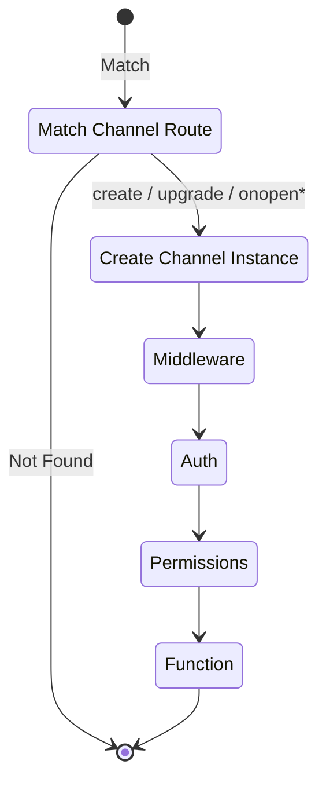
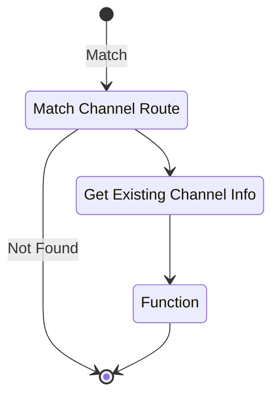
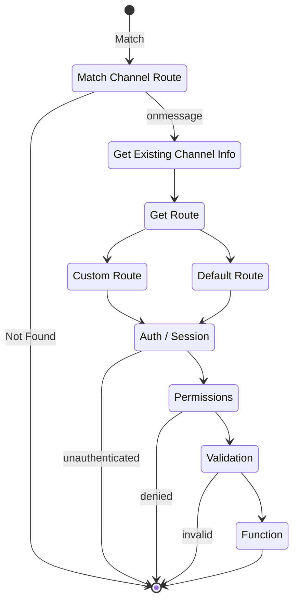

Channels routes in Pikku serve as the entry points for handling Channels (as of now this is just websockets). A channel route registers on the specified path / name and processes any events by calling the relevant functions. 

## Binding a Channel Route

An channel route is a configuration object that defines the behavior for a specific channel request. Here is an example that demonstrates setting up routes for an event service:

```typescript reference title="events.channel.ts"
https://raw.githubusercontent.com/pikkujs/pikku/blob/master/templates/functions/src/channel.routes.ts
```

### Channel Open



In the channel open flow, the process begins by matching an incoming connection with the defined channel route; if a match is found, a new channel instance is created and immediately passes through middleware, authentication and permissions checks before executing the designated function, ensuring secure channel initialization.

### Channel Close



For the channel close process, the system starts by matching the incoming request with the appropriate channel route, then retrieves the existing channel information, and finally calls the corresponding function to cleanly terminate the connection.

### Channel Message



For a channel message, after the incoming message is matched to a channel route and the existing channel details are retrieved through the onmessage event, the system determines whether to follow a custom or default route before proceeding through authentication, permission verification, and message validation; only when all these checks are successfully passed does it finally invoke the relevant function to process the message.