Pikku is built on a simple yet powerful principle: **everything is functions**. This function-first architecture enables unprecedented deployment flexibility, type safety, and code reusability across different runtime environments.

## Everything Is Functions

At its core, Pikku treats all application logic as pure, testable functions. Whether you're handling HTTP requests, WebSocket connections, scheduled tasks, or RPC calls, you write the same function signatures:

```typescript
// This function can be called via HTTP, WebSocket, RPC, or directly
const getUserProfile = pikkuFunc<
  { userId: string },
  { name: string; email: string }
>()
.func(async (services, data, session) => {
  const user = await services.database.getUser(data.userId)
  return { name: user.name, email: user.email }
})
```

The function receives:
- **Services**: Dependency-injected services (database, logger, etc.)
- **Data**: Input data (normalized from any protocol)
- **Session**: User session information

This consistency means your business logic is completely decoupled from how it's invoked.


## Protocol Normalization & Wiring

Pikku's wiring system acts as an adapter layer that normalizes different protocols into a consistent function call interface. When a request comes in, the wiring layer:

1. **Normalizes Input**: Converts protocol-specific data (HTTP body/query, WebSocket message, etc.) into function parameters
2. **Handles Authentication**: Extracts and validates user sessions 
3. **Validates Schema**: Runs input validation against defined schemas
4. **Checks Permissions**: Verifies user has required permissions
5. **Applies Middleware**: Runs wiring and function-specific middleware
6. **Executes Function**: Calls your business logic function
7. **Unnormalizes Output**: Converts function response back to protocol format


This architecture means you can wire the same function to multiple protocols:

```typescript
// Wire to HTTP
addHTTPRoute({
  method: 'get',
  route: '/users/:userId',
  func: getUserProfile,
  auth: true
})

// Wire to WebSocket channel  
addChannel({
  name: 'user-updates',
  onMessageWiring: {
    action: {
      getUserProfile
    }
  }
})

// Wire to RPC (functions are automatically available via RPC)
// No explicit wiring needed - RPC calls functions by name
```

## Deployment Flexibility

Because functions are protocol-agnostic, Pikku can deploy anywhere by providing different runtime adapters. Each runtime calls the same core functions (`runHTTP`, `runChannel`, `runScheduler`, etc.) but adapts them to the target platform:

```mermaid
graph LR
    subgraph "Deployment Targets"
        D1[Express Server]
        D2[AWS Lambda]
        D3[Cloudflare Workers]
        D4[Next.js API Routes]
        D5[Fastify Server]
    end
    
    subgraph "Runtime Adapters"
        R1[runHTTP]
        R2[runChannel]
        R3[runScheduler]
    end
    
    subgraph "Wiring Layer"
        W1[HTTP Wiring]
        W2[Channel Wiring]
        W3[Scheduler Wiring]
    end
    
    subgraph "Your Functions"
        F1[getUserProfile]
        F2[createPost] 
        F3[handleWebSocket]
    end
    
    D1 --> R1
    D2 --> R1
    D2 --> R2
    D2 --> R3
    D3 --> R1
    D3 --> R2
    D3 --> R3
    D4 --> R1
    D5 --> R1
    
    R1 --> W1
    R2 --> W2
    R3 --> W3
    
    W1 --> F1
    W1 --> F2
    W2 --> F3
```



### Runtime Examples

**Express Server:**
```typescript
import { PikkuExpressServer } from '@pikku/express'
import { PikkuTaskScheduler } from '@pikku/schedule'
import {
  createConfig,
  createSingletonServices,
  createSessionServices,
} from '../../functions/src/services.js'

async function main(): Promise<void> {
  const config = await createConfig()
  const singletonServices = await createSingletonServices(config)

  const appServer = new PikkuExpressServer(
    { ...config, port: 4002, hostname: 'localhost' },
    singletonServices,
    createSessionServices
  )
  await appServer.init()
  await appServer.start()

  const scheduler = new PikkuTaskScheduler(singletonServices)
  scheduler.startAll()
}
```

**AWS Lambda:**
```typescript
import { runFetch } from '@pikku/lambda/http'
import { runScheduledTask } from '@pikku/core/scheduler'
import { APIGatewayProxyEvent, ScheduledHandler } from 'aws-lambda'

export const httpRoute = async (event: APIGatewayProxyEvent) => {
  const singletonServices = await coldStart()
  const result = await runFetch(singletonServices, createSessionServices, event)
  return result
}

export const myScheduledTask: ScheduledHandler = async () => {
  const singletonServices = await coldStart()
  await runScheduledTask({
    name: 'myScheduledTask',
    singletonServices,
  })
}
```

**Cloudflare Workers:**
```typescript
import { runFetch, runScheduled } from '@pikku/cloudflare'
import { setupServices } from './setup-services.js'
import { ExportedHandler } from '@cloudflare/workers-types'

export default {
  async scheduled(controller, env) {
    const singletonServices = await setupServices(env)
    await runScheduled(controller, singletonServices)
  },

  async fetch(request, env): Promise<Response> {
    const singletonServices = await setupServices(env)
    return await runFetch(
      request as unknown as Request,
      singletonServices,
      createSessionServices
    )
  },
} satisfies ExportedHandler<Record<string, string>>
```

The same functions run unchanged across all these environments.

## CLI & Inspector: Code Generation Pipeline

Pikku's CLI and Inspector work together to analyze your TypeScript code and generate the necessary wiring and type definitions. This compile-time code generation is what makes Pikku's runtime so lightweight and type-safe.


### Inspector Process

The Inspector uses TypeScript's compiler API to:

1. **Parse Source Files**: Analyzes your function definitions and type annotations
2. **Extract Metadata**: Identifies function signatures, permissions, middleware, and routing information
3. **Build Type Maps**: Creates mappings between TypeScript types and runtime validation schemas
4. **Track Dependencies**: Discovers service dependencies and session requirements

### CLI Generation

Based on Inspector analysis, the CLI generates only what's actually needed through intelligent tree-shaking:

- **Function Registry**: Only imports and maps functions that are actually used
- **Wiring Configurations**: HTTP routes, WebSocket channels, scheduled tasks all reference functions by their `pikkuFuncName`
- **Type Definitions**: TypeScript types for client code generation
- **Runtime Schemas**: JSON schemas for request validation
- **Service Mappings**: Dependency injection configurations

**Function Selection & Tree Shaking:**

Pikku only includes functions in the generated bundle if they meet specific criteria:

1. **Exported Functions**: Automatically included and exposed via RPC (this will change to require `rpc: true` or `rpc: { expose: true }`)
2. **Wired Functions**: Referenced by `addHTTPRoute()`, `addChannel()`, `addScheduler()`, etc.
3. **Tag Filtering**: Functions can be filtered by tags during build time

Functions that aren't exported AND aren't referenced by any wiring are considered unused. While the entire wiring file gets imported (so the function code exists in the bundle), only functions that are actually wired get registered with the runtime and become callable.

The `pikkuFuncName` serves as the universal identifier that connects your functions across all wiring types - whether it's HTTP routes, WebSocket channels, RPC calls, or scheduled tasks, they all reference the same function by this consistent name.

**How `pikkuFuncName` is determined:**
1. **Export Name**: If the function is exported, uses the export name (`export const createUser = ...`)
2. **Defined Name**: If defined in the `pikkuFunc()` object with a name property
3. **File + Line Fallback**: If neither above, uses the filename and line number where the function is defined

```typescript
// Example 1: Exported function - included in bundle, exposed via RPC
export const createUser = pikkuFunc<CreateUserInput, CreateUserOutput>()
.func(async (services, data) => {
  // Implementation
})
// ✅ Included: Exported function
// ✅ Available via RPC

// Example 2: Wired function - included in bundle
const getUserProfile = pikkuFunc<GetUserInput, GetUserOutput>()
.func(async (services, data) => {
  // Implementation
})

wireHTTP({
  method: 'get',
  route: '/users/:id',
  func: getUserProfile
})
// ✅ Included: Referenced by HTTP wiring
// Note: The entire wiring file gets imported, but only wired functions 
// are registered and callable at runtime

// Example 3: Internal helper - tree-shaken out
const validateUserData = pikkuFunc<ValidationInput, ValidationOutput>()
.func(async (services, data) => {
  // Helper function not exported or wired
})
// ❌ Excluded: Not exported, not referenced by any wiring

```

**Tag-Based Filtering:**

Tags are applied to wiring configurations to organize and filter routes, channels, and other endpoints:

```typescript
// Tags are applied to the wiring, not the function itself
wireHTTP({
  auth: false,
  method: 'get',
  route: '/admin/users',
  func: getUserProfile,
  tags: ['admin', 'users']
})

wireChannel({
  name: 'admin-events',
  onConnect: handleAdminConnect,
  tags: ['admin', 'events']
})
```

Tags help organize endpoints and can be used by the CLI for filtering during build processes, allowing you to include/exclude specific routes or channels based on deployment needs.

```typescript
// Generated by CLI - Function registration
// The pikkuFuncName 'createUser' is used as the key
import { addFunction } from '@pikku/core'
import { createUser } from '../src/user.functions.js'

addFunction('createUser', { func: createUser })
```

```typescript
// Generated by CLI - HTTP metadata
// The same pikkuFuncName 'createUser' references the function
import { pikkuState } from '@pikku/core'
pikkuState('http', 'meta', [
  {
    "pikkuFuncName": "createUser",  // Single source of truth
    "route": "/users",
    "method": "post",
    "inputTypes": {
      "body": "CreateUserInput"
    },
    "docs": {
      "description": "Create a new user",
      "tags": ["users"]
    }
  }
])
```

```typescript
// Generated by CLI - Channel metadata
// Same pikkuFuncName used for WebSocket channels
pikkuState('channel', 'meta', {
  "user-updates": {
    "connect": {
      "pikkuFuncName": "createUser"  // Same identifier across all wiring
    }
  }
})
```

### Client Code Generation

The CLI generates type-safe client libraries that can be used in tests and frontend applications:

```typescript
// Generated HTTP client (pikku-fetch.gen.js)
import { pikkuFetch } from '../.pikku/pikku-fetch.gen.js'

// Configure the client
pikkuFetch.setServerUrl('http://localhost:4002')

// Make type-safe requests
const res = await pikkuFetch.fetch('/hello-world', 'GET', null)
```

```typescript
// Generated RPC client (pikku-rpc.gen.js)
import { pikkuRPC } from '../.pikku/pikku-rpc.gen.js'

// Configure the client
pikkuRPC.setServerUrl('http://localhost:4002')

// Call functions directly by name
await pikkuRPC.invoke('helloWorld', null)
```

## Architecture Benefits

This architecture provides several key advantages:

### 1. **Protocol Agnostic**
Write once, deploy to HTTP, WebSocket, RPC, or scheduled tasks without code changes.

### 2. **Type Safety**
End-to-end type safety from database to UI, with compile-time validation and runtime schema checking.

### 3. **Deployment Flexibility** 
Deploy the same code to Express, Lambda, Cloudflare Workers, Next.js, or any other runtime.

### 4. **Minimal Runtime Overhead**
Most complexity is handled at build time, resulting in lightweight runtime execution.

### 5. **Easy Testing**
Pure functions with dependency injection make unit testing trivial.

### 6. **Incremental Adoption**
Can be adopted gradually in existing applications without major rewrites.


This architecture makes Pikku uniquely suited for building scalable, maintainable applications that can evolve with your infrastructure needs without requiring code rewrites.