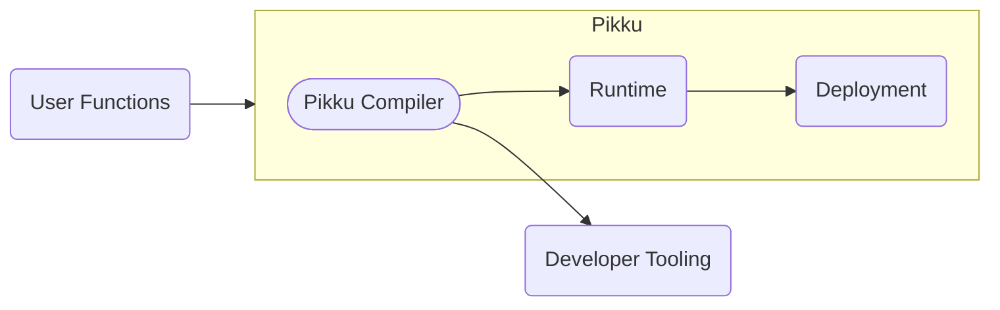
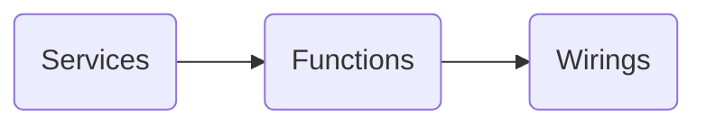
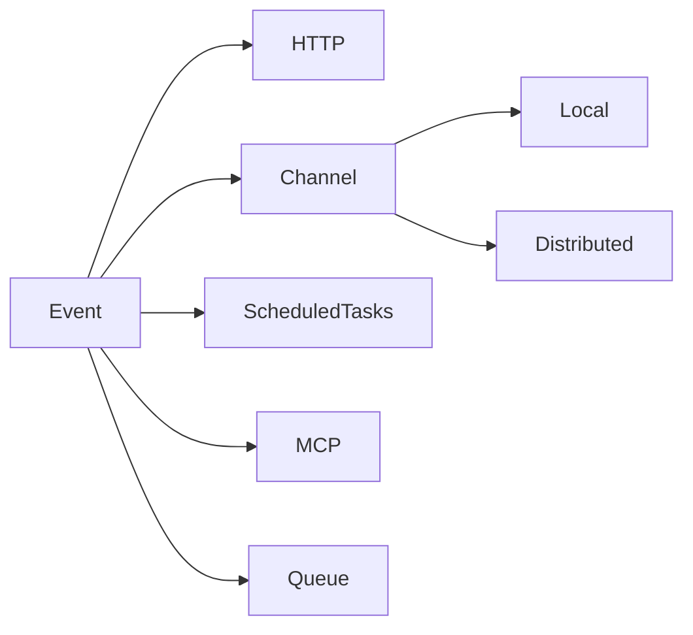

# Introduction to Pikku

**Pikku** redefines modern application development by uniting the best ideas from the Node.js ecosystem. It introduces **Typed Functions**—modular, type-safe functions that are easy to test, deploy, and integrate. By leveraging the TypeScript compiler, Pikku eliminates boilerplate while enforcing strict type-safety across your stack.

Most modern Node.js approaches are split between serverless and server-based models. Each offers benefits, yet they often suffer from issues like high costs, vendor lock-in, and complexity.

# Common Pain Points

Many teams struggle with:
- **High Costs & Lock-In:** Overpriced services and vendor dependence.
- **Underutilized Infrastructure:** Wasted resources.
- **Platform Limitations:** Difficulties integrating with on-premise or enterprise systems.
- **Complexity:** Over-complicated client-server interactions and excessive boilerplate.
- **Deployment & Performance:** Challenges with serverless WebSockets and slow function startups.

---

# The Pikku Solution: Typed Functions

Pikku turns your application into a repository of isolated, testable functions that are:

- 🧩 **Modular:**  Each function is independent.
- 💼 **Portable:**  Run seamlessly on AWS, Cloudflare, Express, and more.
- ☁ **Serverless by Design:**  Enjoy serverless benefits without sacrificing performance.
- 🧘🏽 **Type-Safe:** Built on TypeScript for reliability and fewer runtime errors.

---

# Key Features

- **Protocol Agnostic:** Can be extended to supper any event based system. Currently supporting HTTP, scheduled tasks, and WebSockets.
- **Built-in Services & Auth:** Ready-to-use backend services.
- **Type Safety & Validation:** End-to-end type checking and runtime schema validation.
- **Comprehensive Documentation:** Auto-generated OpenAPI docs and typed plugins.
- **Minimal Overhead:** Eliminates boilerplate via TypeScript integration.

---

# Under the Hood

Pikku uses the TypeScript compiler to automatically generate helpers and wiring for multiple protocols.

*This diagram shows how the layer in pikku are arranged.*

---

## Workflow Overview

Pikku organizes your application into five key layers that work together to simplify development:

### **User Layer**  

  - **Middleware:** Used to run custom user logic before and/or after Functions. 
  - **Services:** Provide foundational utilities such as data access and logging.  
  - **Function Logic:** Contains the core business logic of your application.  
  - **Wirings:** Wire functions to various triggers like HTTP routes, scheduled tasks, and channels.

### **CLI Layer (Pikku CLI & Inspector)**  

   - **Configuration Files:** Define project settings and function locations.  
   - **Pikku CLI & Inspector:** Scans your project to generate necessary artifacts.  
   - **JSON Schemas & OpenAPI:** Ensure type safety and generate standard API documentation.  
   - **Typed Fetch & NextJS Wrapper:** Create type-safe client code and integrate with NextJS.

### **Runtime Layer**  

   - Provides the libraries that handle the different transport types.
   - Ties together middleware, permissioning and data validation.
   - Maps error to their correct responses if provided.

### **Deployment Layer** 

   - Consists of thin wrappers that allow various deployment frameworks (e.g., Express, AWS, Cloudflare) to interact seamlessly with the runtime layer.

---

# Limitations & Caveats

- **Not a Standalone Server:** Pikku is a function repository meant to integrate with your existing infrastructure.
- **Input/Output:** Currently limited to JSON and primitive types.
- **Early Stage:** The framework is in 0.x; features may evolve.

---

# In Summary

**Pikku = Typed Functions + Minimal Overhead**

- **TypeScript-Powered:** Reduces boilerplate and enhances reliability.
- **Versatile:** Supports HTTP, cron jobs, and WebSockets.
- **Portable:** Deploy across various environments.
- **Developer-Centric:** Offers a streamlined CLI and auto-generated helpers.

Pikku unifies serverless, full-stack, and traditional architectures to empower developers in building scalable, cost-efficient applications.

---

# Questions & Next Steps

Learn more or see Pikku in action at the [Pikku website](https://pikku.dev) and join the conversation on GitHub. Your feedback and contributions can shape the future of this exciting project!
