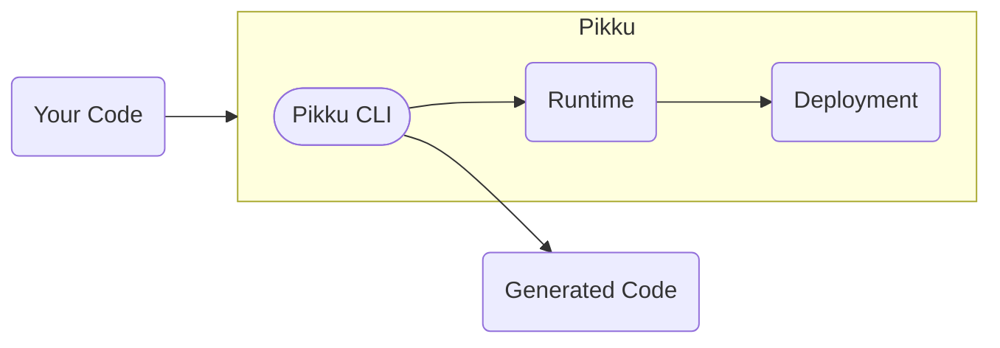

# Introduction to Pikku

**Pikku is a TypeScript backend that adapts.** Like a chameleon that keeps its core intact while adapting to its environment, Pikku lets you write your backend logic once and run it anywhere – HTTP, WebSockets, queues, scheduled tasks, CLI, or AI agent tools.

Define once. Run anywhere. No lock-in. Just TypeScript.

## The Problem

Traditional backend frameworks lock you into choices:

- **Express/Fastify** → Great for servers, terrible for serverless (you bundle the entire framework)
- **AWS Lambda** → Great for functions, forces you to fragment your code across services
- **NestJS** → Heavy runtime that can't tree-shake effectively, forcing architectural decisions upfront

You're forced to choose your architecture before writing code. Want to switch from a monolith to microservices? **Rewrite everything.** Want to optimize a hot path with serverless? **Good luck extracting that logic.**

Types drift. Logic fragments. Vendor lock-in creeps in.

## The Pikku Solution

Pikku flips the script: **architecture becomes a deployment decision, not a coding decision.**

Write your function once:

```typescript
export const sendWelcomeEmail = pikkuFunc({
  func: async ({ email }, data) => {
    await email.send({
      to: data.userEmail,
      subject: 'Welcome!',
      body: `Hello ${data.userName}!`
    })
    return { sent: true }
  }
})
```

Wire it to different protocols:

```typescript
// Call via HTTP after user signup
wireHTTP({ method: 'post', route: '/users', func: createUser })
  .then(() => rpc.invoke('sendWelcomeEmail', { ... }))

// Process from background queue
wireQueueWorker({ queue: 'emails', func: sendWelcomeEmail })

// Trigger on schedule
wireScheduler({ schedule: '0 9 * * *', func: sendDailyDigest })
```

Same business logic. Different entry points. Zero duplication.

## How It Works

Pikku uses static analysis to understand your code:

1. **Scan** - The CLI analyzes your functions and wirings
2. **Filter** - Generate entry points based on what you deploy (`pikku --http-routes=/admin`)
3. **Tree-shake** - Only bundle the functions and services you actually use
4. **Deploy** - Run as a monolith, microservices, or individual functions

This means you can:
- Start as a **multi-MB monolith** for rapid development
- Split into **~100KB microservices** when you need independent scaling
- Optimize to **&lt;50KB functions** for cost efficiency (depending on services needed)

**Same codebase. Different deployment command. No refactoring.**

See [Tree-Shaking](/docs/concepts/tree-shaking) for details on how this works.

## Key Features

### Transport-Agnostic Functions

Your business logic doesn't know or care how it's called:

- 🌐 **HTTP** - REST APIs, webhooks
- 🔌 **WebSocket** - Real-time bidirectional communication
- ⏰ **Scheduled Tasks** - Cron jobs, background processing
- 📬 **Queues** - Async work queues (BullMQ, SQS, PG Boss)
- 🤖 **MCP** - AI agent tools, resources, and prompts
- 💻 **CLI** - Command-line interfaces
- 📡 **RPC** - Internal function-to-function calls

### Built-in Production Features

No stitching libraries together:

- ✅ **Authentication** - Session management across all protocols
- ✅ **Permissions** - Fine-grained authorization
- ✅ **Validation** - Automatic schema validation from TypeScript types
- ✅ **Error Handling** - HTTP status codes, WebSocket errors, MCP codes
- ✅ **Middleware** - Request/response transformation
- ✅ **OpenAPI** - Auto-generated API documentation

### Type Safety End-to-End

- TypeScript types → JSON schemas (automatic validation)
- Type-safe clients generated from your functions
- Compile-time errors instead of runtime surprises

### Deploy Anywhere

Run on any JavaScript runtime:

- **Servers**: Express, Fastify, Bun, uWebSockets
- **Serverless**: AWS Lambda, Cloudflare Workers
- **Frameworks**: Next.js (App Router, Pages Router)
- **Any event-driven system** - Bring your own adapter

## Under the Hood

Pikku has four layers:



### User Layer

You write:
- **Functions** - Pure business logic
- **Services** - Database, cache, logger (plain TypeScript classes)
- **Wirings** - Connect functions to protocols
- **Middleware** - Cross-cutting concerns

### CLI Layer

The Pikku CLI scans your code and generates:
- Type definitions for your entire API
- JSON schemas for validation
- OpenAPI documentation
- Type-safe clients
- Filtered entry points based on deployment flags

### Runtime Layer

The runtime handles:
- Routing requests to functions
- Running middleware and permissions
- Validating input data
- Handling errors
- Managing sessions

### Deployment Layer

Thin adapters for each platform:
- Express middleware
- Lambda handlers
- Cloudflare Workers
- Next.js API routes

## What Makes Pikku Different

| **Aspect** | **Pikku** | **Other Frameworks** |
|------------|-----------|---------------------|
| **Architecture** | Deployment decision | Coding decision |
| **Protocols** | 8+ protocols, one codebase | Pick one, duplicate for others |
| **Tree-shaking** | Filtered entry points | Bundle everything |
| **Serverless** | &lt;50KB functions | 2MB+ per function |
| **Type Safety** | End-to-end (server + client) | Server only |
| **Lock-in** | None - plain TypeScript | Framework-specific patterns |

## Limitations

Pikku is pragmatic, not perfect:

- **Not a standalone server** - Integrates with existing runtimes (Express, Lambda, etc.)
- **JSON only** - Input/output limited to JSON and primitives ([file uploads not yet supported](https://pikku.dev/content))
- **Early stage** - Version 0.x means features may evolve
- **Node/Bun only** - JavaScript runtime required

## Getting Started

Ready to try Pikku?

```bash
npm create pikku@latest
```

Then continue to [Getting Started](/docs/core) to build your first function.

## Philosophy

Pikku believes:

- **Business logic should be portable** - Not tied to Express, Lambda, or any framework
- **Architecture should evolve** - Start simple, optimize later, without rewriting
- **Type safety should be automatic** - Let TypeScript do the work
- **Frameworks should be thin** - Pikku is < 3MB with 2 dependencies

**Write once. Deploy anywhere. That's the Pikku way.**

---

Questions? Join the conversation on [GitHub](https://github.com/pikkujs/pikku).
