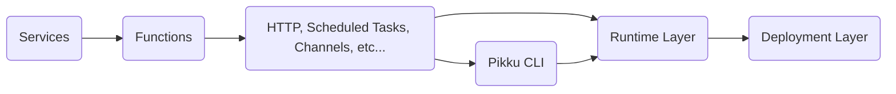
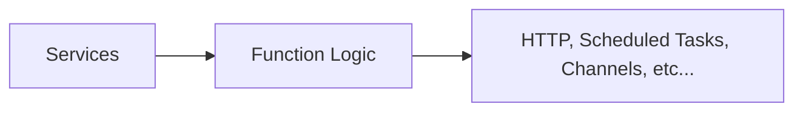
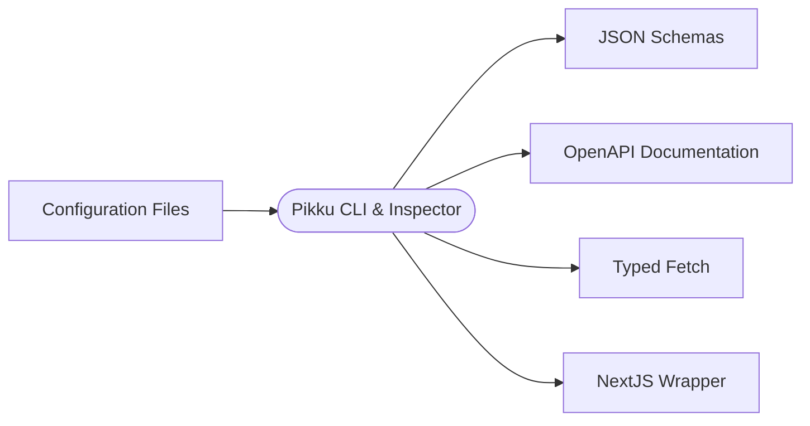
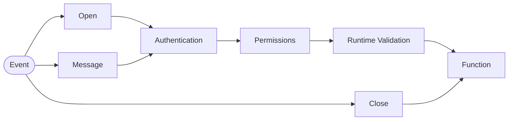

# Introduction to Pikku

**Pikku** redefines modern application development by uniting the best ideas from the Node.js ecosystem. It introduces **Typed Functions**—modular, type-safe functions that are easy to test, deploy, and integrate. By leveraging the TypeScript compiler, Pikku eliminates boilerplate while enforcing strict type-safety across your stack.

---

# The Modern Landscape

Modern Node.js approaches are split between serverless and server-based models. Each offers benefits, yet they often suffer from issues like high costs, vendor lock-in, and complexity.

---

# High-Level Comparison

| Feature       | AWS | Cloudflare | Express | uWebSockets | LoopBack | Encore | Next.js | TanStack | NestJS |
|---------------|-----|------------|---------|-------------|----------|--------|---------|----------|--------|
| **Serverless**    | ✅  | ✅         | ❌      | ❌          | ✅       | ❌     | ❌      | ❌       | ❌     |
| **Functions**     | ✅  | ✅         | ❌      | ❌          | ✅       | ✅     | ❌      | ❌       | ❌     |
| **Services**      | ❌  | ❌         | ❌      | ❌          | ✅       | ❌     | ❌      | ❌       | ✅     |
| **Full Stack**    | ❌  | ❌         | ❌      | ❌          | ❌       | ❌     | ✅      | ✅       | ❌     |

*This table highlights key strengths and weaknesses across various approaches.*

---

# Common Pain Points

Many teams struggle with:
- **High Costs & Lock-In:** Overpriced services and vendor dependence.
- **Underutilized Infrastructure:** Wasted resources.
- **Platform Limitations:** Difficulties integrating with on-premise or enterprise systems.
- **Complexity:** Over-complicated client-server interactions and excessive boilerplate.
- **Deployment & Performance:** Challenges with serverless WebSockets and slow function startups.

---

# The Problem

Traditional architectures often lead to high operational costs and vendor lock-in, making it difficult to adapt or optimize for new platforms.

---

# Our Solution: Typed Functions

Pikku turns your application into a repository of isolated, testable functions that are:

- **Modular:** Each function is independent.
- **Portable:** Run seamlessly on AWS, Cloudflare, Express, and more.
- **Serverless by Design:** Enjoy serverless benefits without sacrificing performance.
- **Type-Safe:** Built on TypeScript for reliability and fewer runtime errors.

---

# Key Features

- **Protocol Agnostic:** Supports HTTP, scheduled tasks, and WebSockets.
- **Built-in Services & Auth:** Ready-to-use backend services.
- **Type Safety & Validation:** End-to-end type checking and runtime schema validation.
- **Comprehensive Documentation:** Auto-generated OpenAPI docs and typed plugins.
- **Minimal Overhead:** Eliminates boilerplate via TypeScript integration.

---

# Under the Hood

Pikku uses the TypeScript compiler to automatically generate helpers and wiring for multiple protocols.

*This diagram shows how core services, functions, and bindings interact through CLI-generated assets and runtime layers.*

---

# Workflow Overview Explained

Pikku structures your project in clear layers. The diagrams below outline the interactions from configuration to runtime execution.

## User Layer

- **Services:** Provide foundational utilities (e.g., data access, auth, logging).
- **Function Logic:** Contains the core business logic.
- **Bindings:** Expose functions to HTTP routes, scheduled triggers, channels, etc.

*Services support function logic, which is then bound to external interfaces.*

---

## Pikku CLI & Inspector

- **Configuration Files:** Define project settings.
- **Pikku CLI & Inspector:** Scans the project to generate artifacts.
- **JSON Schemas & OpenAPI:** Ensure type safety and standard API documentation.
- **Typed Fetch & NextJS Wrapper:** Generate client code and integrate with NextJS.

*This automation boosts productivity and maintains a consistent, type-safe API.*

---

## Runtime Layer

### HTTP Layer

*HTTP requests flow through security and validation before executing functions and returning responses.*

### Scheduled Task

*Simple invocation for periodic or background jobs.*

### Channel / WebSockets

*Real-time events (e.g., WebSockets) are processed through security checks before triggering functions.*

---

# Limitations & Caveats

- **Not a Standalone Server:** Pikku is a function repository meant to integrate with your existing infrastructure.
- **Input/Output:** Currently limited to JSON and primitive types.
- **Early Stage:** The framework is in 0.x; features may evolve.

---

# In Summary

**Pikku = Typed Functions + Minimal Overhead**

- **TypeScript-Powered:** Reduces boilerplate and enhances reliability.
- **Versatile:** Supports HTTP, cron jobs, and WebSockets.
- **Portable:** Deploy across various environments.
- **Developer-Centric:** Offers a streamlined CLI and auto-generated helpers.

Pikku unifies serverless, full-stack, and traditional architectures to empower developers in building scalable, cost-efficient applications.

---

# Questions & Next Steps

Learn more or see Pikku in action at the [Pikku website](https://pikku.dev) and join the conversation on GitHub. Your feedback and contributions can shape the future of this exciting project!
