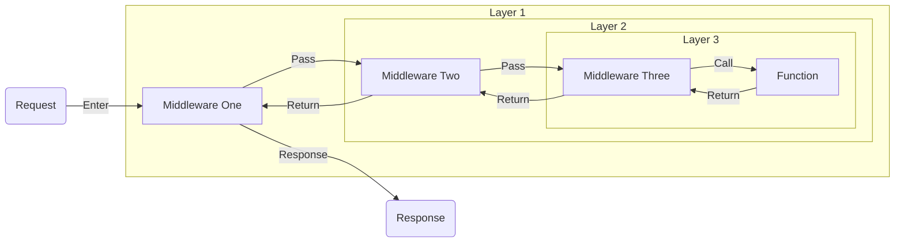

# Middleware

Middleware in Pikku follows an onion model - each middleware wraps around the next, running before and after your function executes. This is the same pattern used by Koa and Hono.



## Your First Middleware

Let's write middleware that tracks response time:

```typescript
import { pikkuMiddleware } from '#pikku/pikku-types.gen.js'

export const responseTime = pikkuMiddleware(async ({ logger }, interaction, next) => {
  const start = Date.now()

  // Call next middleware/function
  await next()

  // After function completes
  const duration = Date.now() - start
  logger.info(`Request completed in ${duration}ms`)

  // For HTTP, you can set headers
  if (interaction.http) {
    interaction.http.response.setHeader('X-Response-Time', `${duration}ms`)
  }
})
```

The middleware:
- Destructures `logger` from services (tree-shaking benefit)
- Has access to the `interaction` object (http, channel, queue, etc.)
- Calls `next()` to continue the chain
- Can run code before and after the function

## Authentication Middleware

A common use case is extracting authentication info:

```typescript
export const authMiddleware = pikkuMiddleware(async ({ jwt, userSession }, interaction, next) => {
  let token = null

  // Extract token based on transport
  if (interaction.http) {
    token = interaction.http.request.getHeader('Authorization')?.replace('Bearer ', '')
  } else if (interaction.channel) {
    // For channels, auth is typically handled during connection
    token = interaction.channel.channelData?.token
  }

  if (token) {
    try {
      const payload = await jwt.verify(token)
      await userSession.set({
        userId: payload.userId,
        role: payload.role
      })
    } catch (e) {
      // Invalid token - continue without session
    }
  }

  await next()
})
```

## Middleware Scopes

Pikku lets you apply middleware at different scopes. Understanding these scopes helps you find the right balance - too broad and you pay a performance cost, too narrow and you end up repeating yourself.

### Function-Level Middleware

Applied directly in your function definition:

```typescript
export const createOrder = pikkuFunc<OrderInput, Order>({
  func: async ({ database }, data) => {
    return await database.insert('orders', data)
  },
  middleware: [validateOrder, checkInventory],
  docs: {
    summary: 'Create a new order',
    tags: ['orders']
  }
})
```

Use function-level middleware for:
- Function-specific validation
- Business logic guards
- Operations that only make sense for this specific function

### Wire-Specific Middleware

Applied when wiring a function to a transport:

```typescript
wireHTTP({
  method: 'post',
  route: '/orders',
  func: createOrder,
  middleware: [rateLimit, auditLog]
})
```

Use wire-specific middleware for:
- Transport-specific concerns (rate limiting for HTTP)
- Route-specific logging or auditing
- Overriding behavior for a specific endpoint

### HTTP Transport Middleware

For HTTP routes specifically, you can apply middleware globally or per-prefix:

```typescript
import { addHTTPMiddleware } from '#pikku/pikku-types.gen.js'

// All HTTP routes will run this middleware
addHTTPMiddleware([corsHeaders, securityHeaders])

// All routes starting with /admin will run this middleware
addHTTPMiddleware('/admin', [requireAuth, requireAdmin])

// All routes starting with /api/v1 will run this middleware
addHTTPMiddleware('/api/v1', [apiKeyValidation])
```

Use HTTP transport middleware for:
- CORS headers for all HTTP routes
- Security headers for all HTTP responses
- Admin section protection
- API versioning concerns
- Different auth strategies per route prefix

### Scheduler Transport Middleware

For scheduled tasks, you can apply middleware globally:

```typescript
import { addSchedulerMiddleware } from '#pikku/pikku-types.gen.js'

// All scheduled tasks will run this middleware
addSchedulerMiddleware([withSchedulerMetrics, withRetry])
```

Use scheduler transport middleware for:
- Performance monitoring across all scheduled tasks
- Retry logic for failed tasks
- Alerting on task failures

## Execution Order

Middleware executes from the broadest scope inward to the most specific. Think of it like layers of an onion - the outer layers run first:

1. **Transport-specific middleware** - All HTTP (`addHTTPMiddleware([...])`) or all Schedulers (`addSchedulerMiddleware([...])`)
2. **Prefix-based middleware** - HTTP routes matching prefix (`addHTTPMiddleware('/prefix', [...])`)
3. **Wire-specific middleware** - Defined in `wireHTTP`/`wireChannel`/etc.
4. **Function-level middleware** - Defined in function config

After the function completes, they run in reverse order (onion model).

Example showing all scopes:

```typescript
// Transport-specific - all HTTP routes
addHTTPMiddleware([corsHeaders])

// Prefix-based - matches /api/v1
addHTTPMiddleware('/api/v1', [apiKeyValidation])

// Function definition
export const updateSettings = pikkuFunc<SettingsInput, Settings>({
  func: async ({ database }, data) => {
    return await database.update('settings', data)
  },
  middleware: [validateSettings],  // Function-level
  docs: {
    summary: 'Update system settings',
    tags: ['settings']
  }
})

// Wiring
wireHTTP({
  method: 'patch',
  route: '/api/v1/settings',
  func: updateSettings,
  middleware: [auditLog]  // Wire-specific
})
```

For this request, middleware runs in this order:
1. `corsHeaders` (transport-specific - all HTTP)
2. `apiKeyValidation` (prefix-based - matches '/api/v1')
3. `auditLog` (wire-specific)
4. `validateSettings` (function-level)
5. **Your function runs**
6. `validateSettings` (after)
7. `auditLog` (after)
8. `apiKeyValidation` (after)
9. `corsHeaders` (after)

## Interaction Object

Middleware receives an `interaction` object that varies by transport:

```typescript
export const transportAware = pikkuMiddleware(async (services, interaction, next) => {
  if (interaction.http) {
    // HTTP-specific: request, response
    const userAgent = interaction.http.request.getHeader('User-Agent')
    interaction.http.response.setHeader('X-Custom', 'value')
  }

  if (interaction.channel) {
    // Channel-specific: connectionId, channelData, userId
    const connectionId = interaction.channel.connectionId
    const customData = interaction.channel.channelData
  }

  if (interaction.queue) {
    // Queue-specific: queue name, payload, attempt
    const attempt = interaction.queue.attempt
  }

  if (interaction.scheduledTask) {
    // Scheduler-specific: cron, lastRun, nextRun
    const cron = interaction.scheduledTask.cron
  }

  await next()
})
```

## Error Handling

Middleware can catch and transform errors:

```typescript
export const errorHandler = pikkuMiddleware(async ({ logger }, interaction, next) => {
  try {
    await next()
  } catch (error) {
    logger.error('Request failed', {
      error: error.message,
      stack: error.stack
    })

    // For HTTP, you can set custom error responses
    if (interaction.http) {
      interaction.http.response.setStatus(500)
      interaction.http.response.setHeader('X-Error-Id', generateErrorId())
    }

    // Re-throw to let Pikku handle it
    throw error
  }
})
```

## Conditional Middleware

Sometimes you only want middleware to run in certain conditions:

```typescript
export const conditionalCache = pikkuMiddleware(async ({ cache }, interaction, next) => {
  // Only cache GET requests
  if (interaction.http?.request.method !== 'GET') {
    return await next()
  }

  const cacheKey = interaction.http.request.path
  const cached = await cache.get(cacheKey)

  if (cached) {
    // Short-circuit - don't call next()
    interaction.http.response.body = cached
    return
  }

  await next()

  // Cache the response after function completes
  await cache.set(cacheKey, interaction.http.response.body)
})
```

## Automatic Schema Validation

Pikku automatically generates and validates schemas based on your TypeScript types. No middleware needed for input validation - it happens before your function runs.

If validation fails, Pikku throws a `ValidationError` with details about which fields failed.

## Best Practices

**Destructure services** - Helps Pikku tree-shake unused services:
```typescript
// ✅ Good - only bundles logger
pikkuMiddleware(({ logger }, interaction, next) => { ... })

// ❌ Bad - bundles all services
pikkuMiddleware((services, interaction, next) => { ... })
```

**Find the right scope** - Too broad and you pay a performance cost, too narrow and you repeat yourself. Start specific and broaden only when needed.

**Keep middleware focused** - Each middleware should do one thing well:
```typescript
// ✅ Good - separate concerns
[authMiddleware, loggingMiddleware, metricsMiddleware]

// ❌ Bad - doing too much
[authLoggingMetricsMiddleware]
```

## Next Steps

- [Permissions](./permission-guards.md) - Authorization and permissions
- [Functions](./functions.md) - Understanding Pikku functions
- [HTTP Wiring](../http/index.md) - Wire functions to HTTP routes
