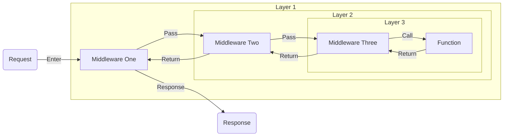

In Pikku we have the main `Functions` that are run.

Each middleware is called in order before the main function, and then called in reverse once the function is completed.

This is similar to the onion approach used by Koa and Hono.



A few examples:

## Response Time

```typescript
const responseTimeMiddlware = async (services, { http }, next) => {
  const start = Date.now()
  // This will wait until all next middleware and function run
  await next()
  const end = Date.now()
  http?.response.setHeader('X-Response-Time', `${end - start}`)
}
```

## Authentication

This is an example on how you can set the user session by simply grabbing it off an `X-user-id` header.

```typescript
const userIdFromHeaderMiddleware = async (services, { http }, next) => {
  await services.userSessionService.set({
    userId: http.request.getHeader('X-user-id')
  })
  // Run next middleware, but nothing else needed
  await next()
}
```

