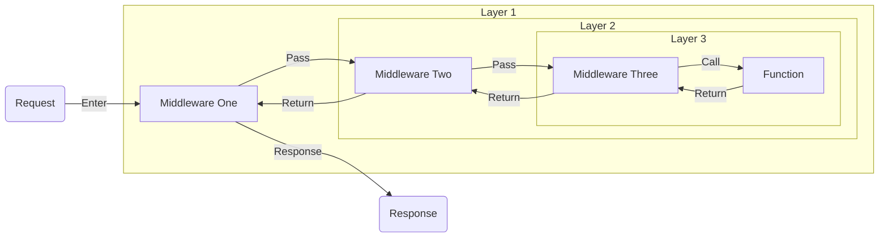

In Pikku we have the main `Functions` that are run.

Each middleware is called in order before the main function, and then called in reverse once the function is completed.

This is similar to the onion approach used by Koa and Hono.



A few examples:

## Response Time

```typescript
const responseTimeMiddlware = async (services, { http }, next) => {
  const start = Date.now()
  // This will wait until all next middleware and function run
  await next()
  const end = Date.now()
  http?.response.setHeader('X-Response-Time', `${end - start}`)
}
```

## Authentication

This is an example on how you can set the user session by simply grabbing it off an `X-user-id` header.

```typescript
const userIdFromHeaderMiddleware = async (services, { http }, next) => {
  await services.userSessionService.set({
    userId: http.request.getHeader('X-user-id')
  })
  // Run next middleware, but nothing else needed
  await next()
}
```

## addMiddleware API

Adds global middleware for a specific tag that applies to any wiring type (HTTP, Channel, Queue, Scheduler, MCP) that includes the matching tag.

### Syntax

```typescript
import { addMiddleware, pikkuMiddleware } from '@pikku/core'

addMiddleware('tagName', [
  pikkuMiddleware(({ logger }, interaction, next) => {
    // Your middleware logic here
    await next()
  })
])
```

### Parameters

- **tag** (`string`) - The tag that the middleware should apply to
- **middleware** - Array of middleware functions created with `pikkuMiddleware()`

### Usage

#### Basic Tag-Based Middleware

```typescript
import { addMiddleware, pikkuMiddleware } from '@pikku/core'

const adminMiddleware = pikkuMiddleware(async ({ userSession }, _interaction, next) => {
  // Check if user is admin before proceeding
  const session = await userSession.get()
  if (session?.role !== 'admin') {
    throw new Error('Admin access required')
  }
  await next()
})

const loggingMiddleware = pikkuMiddleware(({ logger }, _interaction, next) => {
  const start = Date.now()
  logger.info('Request started')
  
  await next()
  
  const duration = Date.now() - start
  logger.info(`Request completed in ${duration}ms`)
})

// Add admin middleware for admin endpoints
addMiddleware('admin', [adminMiddleware])

// Add logging middleware for all API endpoints
addMiddleware('api', [loggingMiddleware])
```

#### Cross-Wiring Type Middleware

The same tag-based middleware will apply across all wiring types:

```typescript
// This middleware will apply to HTTP routes, WebSocket channels, 
// queue workers, scheduled tasks, and MCP tools that have the 'auth' tag
const authMiddleware = pikkuMiddleware(async ({ authService, userSession }, interaction, next) => {
  // Different ways to get auth info depending on the interaction type
  let token = null
  
  if (interaction.http) {
    token = interaction.http.request.getHeader('Authorization')
  } else if (interaction.queue) {
    token = interaction.queue.payload.token
  }
  // For channels, auth is typically handled during connection setup
  
  if (token && await authService.validate(token)) {
    const session = await authService.getSessionFromToken(token)
    await userSession.set(session)
  }
  
  await next()
})

addMiddleware('auth', [authMiddleware])
```

### Using Tags in Wirings

#### HTTP Routes

```typescript
import { wireHTTP } from '@pikku/core'

// This route will run the 'api' and 'admin' middleware
wireHTTP({
  method: 'POST',
  route: '/admin/users',
  func: createUser,
  tags: ['api', 'admin'] // Middleware for both tags will be applied
})
```

#### WebSocket Channels

```typescript
import { wireChannel } from '@pikku/core'

// This channel will run the 'api' middleware
wireChannel({
  name: 'user-notifications',
  func: handleUserNotification,
  tags: ['api'] // Only 'api' middleware will be applied
})
```

#### Queue Workers

```typescript
import { wireQueueWorker } from '@pikku/core'

// This queue worker will run the 'api' and 'background' middleware
wireQueueWorker({
  queue: 'email-processing',
  func: processEmailQueue,
  tags: ['api', 'background']
})
```

#### Scheduled Tasks

```typescript
import { wireScheduler } from '@pikku/core'

// This scheduled task will run the 'background' middleware
wireScheduler({
  cron: '0 0 * * *',
  func: dailyCleanup,
  tags: ['background']
})
```

### Middleware Execution Order

Tag-based middleware is executed as part of the overall middleware chain in this order:

1. **Wiring-level tag middleware** (from wiring's `tags` property)
2. **Wiring-level middleware** (from wiring's `middleware` property)
3. **Function-level middleware** (from function config's `middleware` property)
4. **Function-level tag middleware** (from function config's `tags` property)

### Error Handling

If middleware for a tag already exists, an error will be thrown:

```typescript
addMiddleware('api', [middleware1])

// This will throw an error
addMiddleware('api', [middleware2]) 
// Error: Middleware for tag 'api' already exists. Use a different tag or remove the existing middleware first.
```

