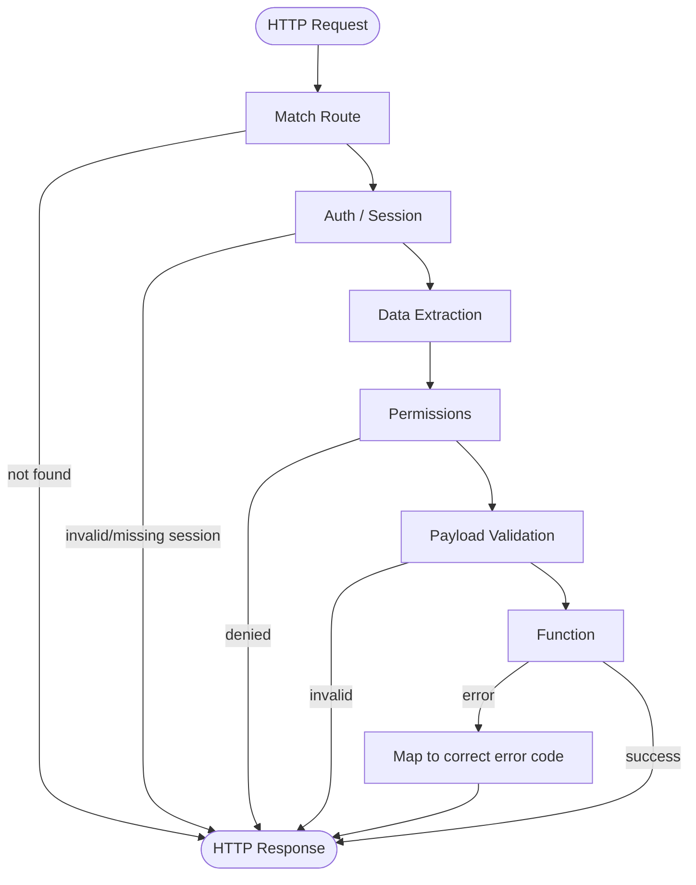

HTTP API routes in Pikku serve as the entry points for handling HTTP requests. When a request is made, an HTTP API route is registered on a specified path and processes the request.

## Binding a HTTP Route

An API route is a configuration object that defines the behavior for a specific HTTP request. Here is an example that demonstrates setting up routes for fetching and updating a book:

```typescript
addHTTPRoute({
  // The method type
  method: 'patch',
  // The method route
  route: '/todo/:todoId',
  // The function to call
  func: updateTodo,
  // The permissions to check before calling the function (supports both and/ors)
  permissions: {
    isTodoCreator: [isTodoCreator, withinAPILimits],
    isAdmin
  },
  // Whether the route needs a session
  auth: true,
  // Info to use when generating OpenAPI docs
  docs: {
    errors: [NotFoundError],
    description: 'Updates a todo',
    tags: ['todos']
  }
})
```

## How HTTP Routes work

<details>
 <summary>The HTTP flow diagram</summary>

</details>

#### **Finding the route**

Check if the route is registered.

#### **Validating the session (if required)**

If the route doesn't have `auth: false` it will then try to retrieve the user session via the [SessionService](../api/session-service.md).

#### **Extracting and validating request data**

<details>
<summary>Handling Data Conflicts</summary>

Pikku takes a strict approach to prevent conflicts between different data sources. Below are three common approaches to handling data conflicts:

| **Approach**                         | **Pros**                                                                 | **Cons**                                                                    |
|--------------------------------------|--------------------------------------------------------------------------|-----------------------------------------------------------------------------|
| **1. Explicit Source Selection**     | - Clear and unambiguous.                                                 | - Requires more code to handle data from each source explicitly.            |
|                                      | - Reduces accidental conflicts.                                          | - Tedious when sharing many parameters across different sources.            |
|                                      | - Ideal for generating documentation.                                    |                                                                             |
| **2. Establish Priority Rules**      | - Allows flexibility without needing explicit handling for each source.  | - Implicit rules can lead to unexpected behavior.                           |
|                                      | - Convenient for simple cases.                                           | - Debugging becomes harder in the event of priority conflicts.              |
| **3. Fail Fast for Conflicting Data**| - Enforces consistency upfront.                                          | - Introduces additional error-handling logic.                               |
|                                      | - Flags ambiguous situations early, ensuring data integrity.             | - Users must provide consistent values across all sources.                  |
</details>

Pikku automatically merges request data from query parameters, path parameters, and the request body. If conflicting data is found (e.g., `bookId` in the path and body don't match), an error is thrown to ensure consistency. 

For instance, given the following route and request:

```typescript
/v1/book/:bookId
```

```typescript
httpPost(`/v1/book/abc?bookId=abc`, {
    bookId: 'abc'
});
```

If all sources match, the request proceeds. If there are discrepancies, an error is generated.

#### **Handling permissions**

You can see how permissions work in depth [here](../core/permission-guards.md).

#### **Validating Payload**

Pikku automatically ensures that any parameters used in the paths are inside of the data object. If they are missing it would throw an error.

It also automatically extracts the input type during compile time which creates a json schema to validate against.

You can see more about it [here](../concepts/types-and-schemas.md).

#### **Returning a success response or an error code**

The final stage is taking the result of the pipeline, whether it's an error message from any of the stages or the response from the function, and sending it back via a response.

If an error was thrown, it would use the [error](../core/errors.md) mechanism to map it to the correct message and status code.

## Summary

API routes in Pikku map HTTP requests to functions, providing a structured, consistent approach to request handling. This method guarantees data validation, error handling, and session management, ensuring that requests are handled securely and efficiently. In future iterations, improvements to scalability, schema inference, and documentation generation will be explored.