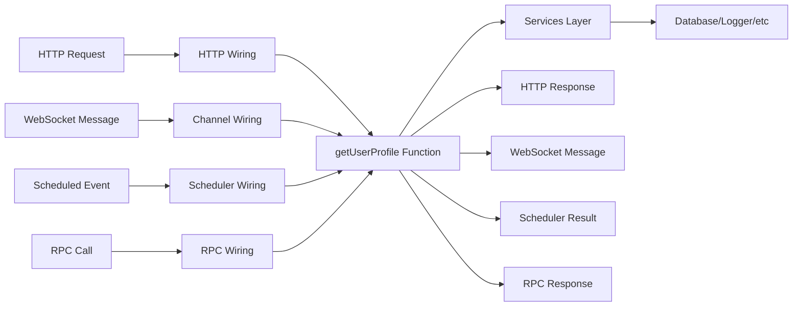
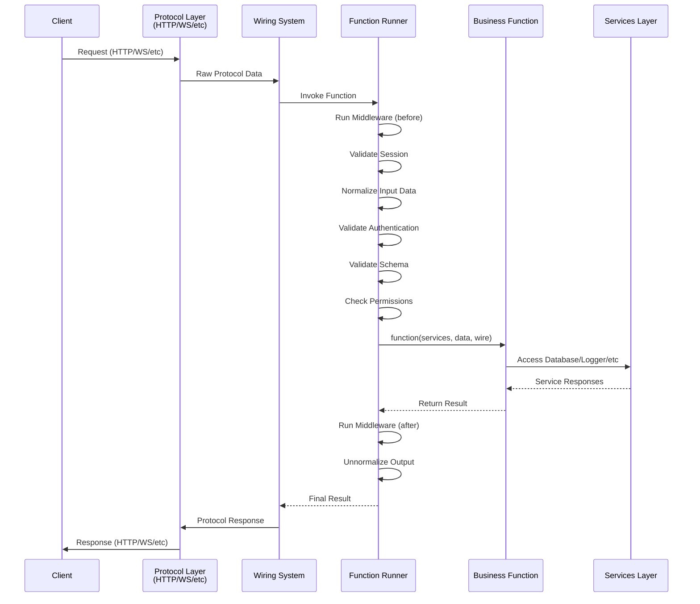
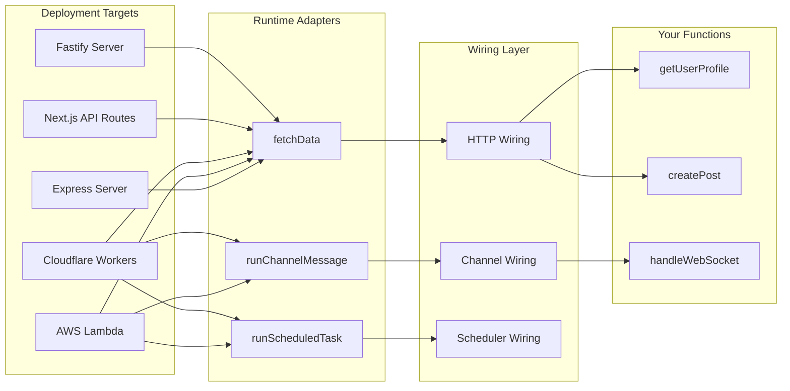

Pikku is built on a simple yet powerful principle: **everything is functions**. This function-first architecture enables
 deployment flexibility, type safety, and code reusability across different runtime environments.

## Everything Is Functions

At its core, Pikku treats all application logic as pure, testable functions. Whether you're handling HTTP requests, WebSocket connections, scheduled tasks, or RPC calls, you write the same function signatures:

```typescript
import { pikkuFunc } from '#pikku/function'

// This function can be called via HTTP, WebSocket, RPC, or directly
const getUserProfile = pikkuFunc<
  { userId: string },
  { name: string; email: string }
>({
  func: async ({ database }, data) => {
    const user = await database.getUser(data.userId)
    return { name: user.name, email: user.email }
  },
  title: 'Get user profile',
  tags: ['users']
})
```

The function receives:
- **Services**: Dependency-injected services (database, logger, etc.)
- **Data**: Input data (normalized from any protocol)
- **Wire**: Transport-specific details (session, HTTP, channel, etc.)

This consistency means your business logic is completely decoupled from how it's invoked.



## Protocol Normalization & Wiring

Pikku's wiring system acts as an adapter layer that normalizes different protocols into a consistent function call interface. When a request comes in, the function runner:

1. **Runs Middleware (before)**: Executes before hooks
2. **Validates Session**: Extracts and validates the user session
3. **Normalizes Input Data**: Converts protocol-specific data into function parameters
4. **Validates Authentication**: Validates user authentication if required
5. **Validates Schema**: Runs input validation against defined schemas
6. **Checks Permissions**: Verifies user has required permissions
7. **Executes Function**: Calls your business logic function
8. **Runs Middleware (after)**: Executes after hooks
9. **Unnormalizes Output**: Converts function response back to protocol format



This architecture means you can wire the same function to multiple protocols:

```typescript
import { wireHTTP } from '#pikku/http'
import { wireChannel } from '#pikku/channel'

// Wire to HTTP
wireHTTP({
  method: 'get',
  route: '/users/:userId',
  func: getUserProfile
})

// Wire to WebSocket channel
wireChannel({
  name: 'user-updates',
  route: '/user-updates',
  onMessageWiring: {
    action: {
      getUserProfile: { func: getUserProfile }
    }
  }
})

// Expose via RPC (set expose: true on the function; there is no wire* call)
// External callers reach it at POST /rpc/:rpcName
```

## Deployment Flexibility

Because functions are protocol-agnostic, Pikku can deploy anywhere by providing different runtime adapters. Each runtime calls the same core runners (`fetchData` for HTTP, `runChannelMessage` for channels, `runScheduledTask` for scheduled tasks, and so on) but adapts them to the target platform:



### Runtime Examples

**Express Server:**
```typescript
import { PikkuExpressServer } from '@pikku/express'
import { InMemorySchedulerService } from '@pikku/schedule'
import { createConfig } from '../../functions/src/config.js'
import { createSingletonServices } from '../../functions/src/services.js'
import '#pikku/pikku-bootstrap.gen.js'

async function main(): Promise<void> {
  const config = await createConfig()
  const singletonServices = await createSingletonServices(config)

  const appServer = new PikkuExpressServer(
    { ...config, port: 4002, hostname: 'localhost' },
    singletonServices.logger
  )
  await appServer.init()
  await appServer.start()

  const scheduler = new InMemorySchedulerService()
  await scheduler.start()
}
```

**AWS Lambda:**
```typescript
import { runFetch } from '@pikku/lambda/http'
import { runScheduledTask } from '@pikku/core/scheduler'
import { APIGatewayProxyEvent, ScheduledHandler } from 'aws-lambda'
import { coldStart } from './cold-start.js'
import '#pikku/pikku-bootstrap.gen.js'

export const httpRoute = async (event: APIGatewayProxyEvent) => {
  await coldStart()
  const result = await runFetch(event)
  return result
}

export const myScheduledTask: ScheduledHandler = async () => {
  await coldStart()
  await runScheduledTask({
    name: 'myScheduledTask',
  })
}
```

**Cloudflare Workers:**
```typescript
import { runFetch, runScheduled } from '@pikku/cloudflare'
import { setupServices } from './setup-services.js'
import { ExportedHandler } from '@cloudflare/workers-types'
import '#pikku/pikku-bootstrap.gen.js'

export default {
  async scheduled(controller, env) {
    await setupServices(env)
    await runScheduled(controller)
  },

  async fetch(request, env): Promise<Response> {
    await setupServices(env)
    return await runFetch(request as unknown as Request)
  },
} satisfies ExportedHandler<Record<string, string>>
```

The same functions run unchanged across all these environments.

## CLI & Inspector: Code Generation Pipeline

Pikku's CLI and Inspector work together to analyze your TypeScript code and generate the necessary wiring and type definitions. This compile-time code generation is what makes Pikku's runtime so lightweight and type-safe.


### Inspector Process

The Inspector uses TypeScript's compiler API to:

1. **Parse Source Files**: Analyzes your function definitions and type annotations
2. **Extract Metadata**: Identifies function signatures, permissions, middleware, and routing information
3. **Build Type Maps**: Creates mappings between TypeScript types and runtime validation schemas
4. **Track Dependencies**: Discovers service dependencies and session requirements

### CLI Generation

Based on Inspector analysis, the CLI generates only what's actually needed through intelligent tree-shaking:

- **Function Registry**: Only imports and maps functions that are actually used
- **Wiring Configurations**: HTTP routes, WebSocket channels, scheduled tasks all reference functions by their `pikkuFuncId`
- **Type Definitions**: TypeScript types for client code generation
- **Runtime Schemas**: JSON schemas for request validation
- **Service Mappings**: Dependency injection configurations

**Function Selection & Tree Shaking:**

Pikku only includes functions in the generated bundle if they meet specific criteria:

1. **Wired Functions**: Referenced by `wireHTTP()`, `wireChannel()`, `wireScheduler()`, etc. — the wiring registers the function when its file is imported
2. **Exposed Functions**: Marked `expose: true`, which registers them for external `POST /rpc/<name>` calls
3. **Invoked Functions**: Called by name through internal RPC or referenced by an agent, MCP or workflow wiring
4. **Tag Filtering**: Functions can be filtered by tags during build time

A function that is only exported — never wired, exposed or invoked — is not registered. Exporting it makes it a module export, not a callable endpoint.

The `pikkuFuncId` serves as the universal identifier that connects your functions across all wiring types - whether it's HTTP routes, WebSocket channels, RPC calls, or scheduled tasks, they all reference the same function by this consistent name.

**How `pikkuFuncId` is determined:**
1. **Explicit Name**: An `override` property on the function config
2. **Export Name**: If the function is exported, uses the export name (`export const createUser = ...`)
3. **Deterministic Fallback**: If neither above, a hash derived from the function file's path and its position in the file

```typescript
// Example 1: Exposed function - registered and callable via RPC
export const createUser = pikkuFunc<CreateUserInput, CreateUserOutput>({
  expose: true,
  func: async (services, data) => {
    // Implementation
  }
})
// ✅ Included: expose: true registers it
// ✅ Available via RPC

// Example 2: Wired function - registered by its wiring
const getUserProfile = pikkuFunc<GetUserInput, GetUserOutput>({
  func: async (services, data) => {
    // Implementation
  }
})

wireHTTP({
  method: 'get',
  route: '/users/:id',
  func: getUserProfile
})
// ✅ Included: the HTTP wiring registers it

// Example 3: Internal helper - not registered
const validateUserData = pikkuFunc<ValidationInput, ValidationOutput>({
  func: async (services, data) => {
    // Helper function not exported or wired
  }
})
// ❌ Not registered: not wired, exposed, or invoked

```

**Tag-Based Filtering:**

Tags can be declared on the function itself or on a wiring, and help organize routes, channels, and other endpoints:

```typescript
// Tags can come from the wiring...
wireHTTP({
  method: 'get',
  route: '/admin/users',
  func: getUserProfile,
  tags: ['admin', 'users']
})

wireChannel({
  name: 'admin-events',
  onConnect: handleAdminConnect,
  tags: ['admin', 'events']
})
```

Tags help organize endpoints and can be used by the CLI for filtering during build processes, allowing you to include/exclude specific routes or channels based on deployment needs.

```typescript
// Generated by CLI - Function registration
// The pikkuFuncId 'createUser' is used as the key
import { addFunction } from '@pikku/core/function'
import { createUser } from '../src/user.functions.js'

addFunction('createUser', createUser)
```

Generated HTTP metadata is keyed by method, then route. The same `pikkuFuncId`
that registered the function references it here, in `http/pikku-http-wirings-meta.gen.json`:

```json
{
  "post": {
    "/users": {
      "pikkuFuncId": "createUser",
      "route": "/users",
      "method": "post",
      "inputTypes": {
        "body": "CreateUserInput"
      }
    }
  }
}
```

WebSocket channels use the same identifier, in `channel/pikku-channels-meta.gen.json`:

```json
{
  "user-updates": {
    "connect": {
      "pikkuFuncId": "createUser"
    }
  }
}
```

### Client Code Generation

The CLI generates type-safe client libraries that can be used in tests and frontend applications:

```typescript
// Generated HTTP client (pikku-fetch.gen.js)
import { pikkuFetch } from '../.pikku/pikku-fetch.gen.js'

// Configure the client
pikkuFetch.setServerUrl('http://localhost:4002')

// Make type-safe requests
const res = await pikkuFetch.fetch('/hello-world', 'GET', null)
```

```typescript
// Generated RPC client (pikku-rpc.gen.js)
import { pikkuRPC } from '../.pikku/pikku-rpc.gen.js'

// Configure the client
pikkuRPC.setServerUrl('http://localhost:4002')

// Call functions directly by name
await pikkuRPC.invoke('helloWorld', null)
```

