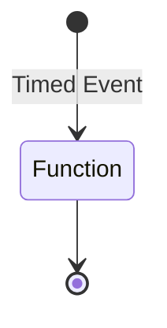

Scheduled tasks (also known as **cron jobs**) are tasks that are run on a specific interval.

The triggering mechanism can either be provided by the runtime (like via an azure timer request) or by using the `@pikku/scheduler` package.



The main steps remain the same:

1. Create a `pikkuVoidFunc` that you wish to trigger. Since this is triggered by time, it doesn't get given any actual data nor does it expect anything in return.
2. Register the function via `addScheduledTask`
3. Run the tasks when needed

### Creating and registering the function

```typescript
import { pikkuVoidFunc } from '@pikku-workspace-starter/functions/.pikku/pikku-types.js'
import { addScheduledTask } from '@pikku/core/scheduler'

export const myScheduledTask = pikkuVoidFunc(async (
  services, _, session
) => {
  // do something
})

addScheduledTask({
  name: 'myScheduledTask',
  schedule: '*/1 * * * *',
  func: myScheduledTask,
})
```

The reason we use **pikkuVoidFunc** instead of a special **ScheduledTask** type is simply to minimize types, as well as also allowing our scheduled task to also be called via a HTTP endpoint if we want to trigger it manually.

### Adding it via the @pikku/scheduler

You can then run the scheduled tasks by specifying them in the runner.

```typescript
import { getConfig } from '../src/config.js'
import { createSingletonServices } from '../src/services.js'
import { PikkuTaskScheduler} from '@pikku/schedule'
import { ScheduledTaskNames } from '../.pikku/pikku-schedules.js'
 
async function main(): Promise<void> {
  try {
    const config = await getConfig()
    const singletonServices = await createSingletonServices(config)
    const scheduler = new PikkuTaskScheduler<ScheduledTaskNames>(singletonServices)
    scheduler.startAll()
  } catch (e: any) {
    console.error(e.toString())
    process.exit(1)
  }
}

main()
```
