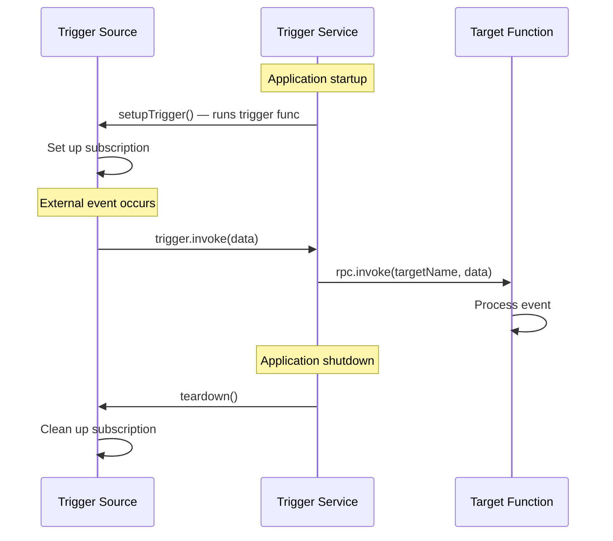

# Triggers

Triggers let you subscribe to external events and react when they occur. Redis pub/sub messages, database change streams, Telegram updates, or any event source — triggers provide a consistent pattern for event-driven code.

A trigger has two parts:
1. **Trigger source** — a function that sets up a subscription and fires events (`pikkuTriggerFunc`)
2. **Trigger target** — an RPC function or workflow that runs when the trigger fires

## Your First Trigger

### 1. Create the trigger source

The trigger source subscribes to an external event and calls `trigger.invoke()` when something happens:

```typescript
// poll-trigger.function.ts
import { pikkuTriggerFunc } from '#pikku'

export const pollForUpdates = pikkuTriggerFunc<
  { url: string; intervalMs: number },  // Input - configuration
  { data: any }                          // Output - what gets fired
>({
  title: 'Poll for updates',
  description: 'Polls an external URL for new data',
  func: async ({ logger }, { url, intervalMs }, { trigger }) => {
    logger.info(`Starting poll trigger for ${url}`)

    const interval = setInterval(async () => {
      const response = await fetch(url)
      const data = await response.json()
      trigger.invoke({ data })
    }, intervalMs)

    // Return teardown function for cleanup
    return () => {
      clearInterval(interval)
      logger.info(`Stopped polling ${url}`)
    }
  }
})
```

The trigger function:
1. Receives services and input configuration
2. Sets up the subscription
3. Calls `trigger.invoke(data)` when events occur
4. Returns a teardown function for cleanup

### 2. Create the target function

The target is a regular Pikku function that runs when the trigger fires:

```typescript
// on-update.function.ts
import { pikkuSessionlessFunc } from '#pikku'

export const onUpdate = pikkuSessionlessFunc({
  func: async ({ logger, database }, data) => {
    logger.info('Received update from trigger')
    await database.insert('events', data)
    return data
  },
  title: 'Handle update event',
  internal: true  // Not exposed via external RPC
})
```

### 3. Wire them together

Triggers use two wiring functions. This separation exists because the trigger source (the subscription) can run on a different machine from the consumer (the target function). `wireTrigger` declares the target, `wireTriggerSource` registers the subscription:

```typescript
// updates.trigger.ts
import { wireTrigger, wireTriggerSource } from '#pikku/trigger'
import { onUpdate } from './functions/on-update.function.js'
import { pollForUpdates } from './functions/poll-trigger.function.js'

// Declare the trigger and its target
wireTrigger({
  name: 'poll-updates',
  func: onUpdate  // The function to invoke when trigger fires
})

// Register the subscription source
wireTriggerSource({
  name: 'poll-updates',  // Must match wireTrigger name
  func: pollForUpdates,
  input: { url: 'https://api.example.com/updates', intervalMs: 5000 }
})
```

## How It Works



The trigger service handles the lifecycle automatically:
1. On startup, it calls your trigger function which sets up the subscription
2. When events arrive, `trigger.invoke()` dispatches to the target via RPC
3. On shutdown, it calls the teardown function to clean up

## Declaration vs Source

The two-part wiring pattern separates **what to do** from **how to detect events**:

- **`wireTrigger`** — declares the trigger name and its target function
- **`wireTriggerSource`** — registers the subscription implementation

The trigger source (the thing listening for events) often runs on a different machine from the consumer (the function that reacts). For example, a Redis subscriber might run on a dedicated worker while the target RPC function runs on your API servers. Splitting the declaration from the source lets you deploy them independently — each side only imports what it needs.

## Real-World Examples

### Redis Pub/Sub

```typescript
import { pikkuTriggerFunc } from '#pikku'

export const redisSubscribe = pikkuTriggerFunc<
  { channels: string[] },
  { channel: string; message: any }
>({
  title: 'Redis Subscribe',
  description: 'Subscribes to Redis pub/sub channels',
  func: async ({ redis }, { channels }, { trigger }) => {
    const subscriber = redis.duplicate()

    subscriber.on('message', (channel, message) => {
      trigger.invoke({
        channel,
        message: JSON.parse(message)
      })
    })

    await subscriber.subscribe(...channels)

    return async () => {
      await subscriber.unsubscribe()
      await subscriber.quit()
    }
  }
})
```

### PostgreSQL Change Streams

```typescript
import { pikkuTriggerFunc } from '#pikku'

export const postgresChanges = pikkuTriggerFunc<
  { table: string; events: ('INSERT' | 'UPDATE' | 'DELETE')[] },
  { event: string; table: string; data: any }
>({
  title: 'Postgres Changes',
  description: 'Triggers on row changes in a PostgreSQL table',
  func: async ({ postgres }, { table, events }, { trigger }) => {
    const client = await postgres.connect()
    const channel = `pikku_notify_${table}`

    // Create notification trigger on the table
    await client.query(`
      CREATE OR REPLACE FUNCTION pikku_notify_${table}()
      RETURNS trigger AS $$
      BEGIN
        PERFORM pg_notify('${channel}', json_build_object(
          'event', TG_OP,
          'table', TG_TABLE_NAME,
          'data', row_to_json(NEW)
        )::text);
        RETURN NEW;
      END;
      $$ LANGUAGE plpgsql;
    `)

    for (const event of events) {
      await client.query(`
        CREATE OR REPLACE TRIGGER pikku_trigger_${table}_${event.toLowerCase()}
        AFTER ${event} ON ${table}
        FOR EACH ROW EXECUTE FUNCTION pikku_notify_${table}();
      `)
    }

    client.on('notification', (msg) => {
      if (msg.channel === channel && msg.payload) {
        trigger.invoke(JSON.parse(msg.payload))
      }
    })

    await client.query(`LISTEN ${channel}`)

    return async () => {
      await client.query(`UNLISTEN ${channel}`)
      client.release()
    }
  }
})
```

### Polling

```typescript
import { pikkuTriggerFunc } from '#pikku'

export const pollTrigger = pikkuTriggerFunc<
  { eventName: string },
  { payload: string }
>(async ({ logger }, { eventName }, { trigger }) => {
  logger.info(`Trigger setup for event: ${eventName}`)

  const interval = setInterval(() => {
    trigger.invoke({ payload: `event from ${eventName}` })
  }, 1_000)

  return () => {
    clearInterval(interval)
    logger.info(`Trigger teardown for event: ${eventName}`)
  }
})
```

Note that `pikkuTriggerFunc` supports both the config object syntax (with `title`, `description`, etc.) and the direct function syntax shown above.

## Triggering Workflows

Triggers can also start [graph workflows](../workflows/index.md) instead of simple RPC calls:

```typescript
wireTrigger({
  name: 'order-received',
  func: processOrderWorkflow,
  graph: 'process-order'  // Start this graph workflow
})
```

When the trigger fires, it starts a new workflow execution instead of calling a single function.

## Trigger Metadata

Like other Pikku functions, trigger sources support metadata for documentation and organization:

```typescript
export const myTrigger = pikkuTriggerFunc<Input, Output>({
  title: 'My Trigger',
  description: 'Detailed description of what this trigger does',
  tags: ['redis', 'realtime'],
  input: InputSchema,   // Standard Schema for input validation
  output: OutputSchema,  // Standard Schema for output validation
  func: async (services, input, { trigger }) => {
    // ...
  }
})
```

## Use Cases

- **Message queues** — Redis pub/sub, AMQP, MQTT
- **Database changes** — PostgreSQL LISTEN/NOTIFY, MongoDB change streams
- **External APIs** — Telegram bots, webhook polling, RSS feeds
- **File system** — File watchers, directory monitors
- **Custom sources** — Any event-driven system

## Next Steps

- [Functions](../../core-features/functions.md) — Understanding Pikku functions
- [Workflows](../workflows/index.md) — Multi-step processes triggered by events
- [Scheduled Tasks](../scheduled-tasks.md) — Time-based triggers
