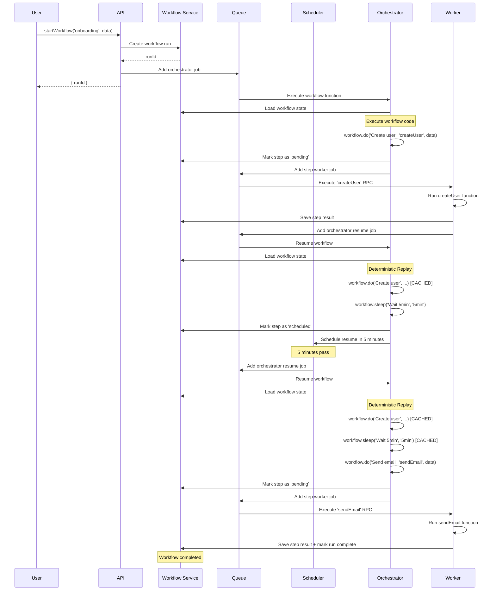

# How Workflows Work

This page explains the internal mechanics of Pikku workflows, including execution models, deterministic replay, and queue interactions.

## Execution Models

Workflows support three execution approaches that can be mixed within a single workflow:

### Queue-Based Execution (RPC Steps)

RPC steps run as separate queue jobs, providing maximum durability:

```typescript
// Each RPC step executes in its own queue job
await workflow.do('Validate payment', 'validatePayment', { orderId })
await workflow.do('Reserve inventory', 'reserveInventory', { orderId })

// With retry configuration
await workflow.do(
  'Process payment',
  'processPayment',
  { orderId, amount: 100 },
  {
    retries: 3,       // Retry up to 3 times on failure
    retryDelay: '5s'  // Wait 5 seconds between retries
  }
)
```

**Characteristics**:
- Steps survive server restarts
- Horizontal scaling via multiple workers
- Maximum reliability for critical operations
- Configurable retries with delays

**Best for**: Long-running workflows, payment processing, order fulfillment

### Inline Execution

Steps execute immediately, but on failure, the orchestrator is re-queued for retry:

```typescript
// Passing a function makes it execute inline
await workflow.do(
  'Validate order',
  async () => validateOrder(orderId),
  {
    retries: 2,        // Retry up to 2 times on failure
    retryDelay: '3s'   // Wait 3 seconds before re-queueing orchestrator
  }
)

// External API call with retries
await workflow.do(
  'Fetch from external API',
  async () => externalApi.getData(),
  {
    retries: 3,
    retryDelay: '2s'
  }
)
```

**Characteristics**:
- Executes immediately on first attempt
- On failure, orchestrator re-queues with delay
- Results cached for replay
- State tracking

**Best for**: Fast operations, validation, data transformation, external API calls

### Sleep for Delays

Pause workflow execution without holding resources using the scheduler service:

```typescript
// Workflow pauses for 7 days, resources freed
await workflow.sleep('Wait for trial period', '7d')
```

**Characteristics**:
- Uses scheduler service to resume workflow after delay
- No resources held during sleep
- Precise resume timing
- Workflow state persisted

**Best for**: Trial periods, reminder emails, rate limiting

### Mixing Execution Models

Combine approaches in a single workflow:

```typescript
export const orderFlow = pikkuWorkflowFunc(async ({ workflow }, { orderId }) => {
  // Fast validation inline (passing function makes it inline)
  await workflow.do('Validate order', async () => validate(orderId))

  // Critical payment in queue (passing RPC name makes it queue-based)
  await workflow.do('Process payment', 'processPayment', { orderId })

  // Wait before follow-up
  await workflow.sleep('Wait for shipping', '2d')

  // Send tracking info
  await workflow.do('Send tracking', 'sendTracking', { orderId })
})
```

## How It Works Internally

### Queue Interaction Flow



### Deterministic Replay

When a workflow resumes (after sleep, failure, or RPC completion), it **replays from the beginning** using cached results.

**Why replay?**
- Ensures complex branching logic works correctly
- Allows workflows to resume after any interruption
- Prevents duplicate operations (payments, emails, etc.)

**Example:**

```typescript
export const workflow = pikkuWorkflowFunc(async ({ workflow }, data) => {
  const user = await workflow.do('Create user', 'createUser', data)
  // Pass 1: ✓ Creates user in database
  // Pass 2: ✗ SKIPPED - returns cached user

  const crmUser = await workflow.do('Add to CRM', async () => crmApi.create(user))
  // Pass 1: ✓ Creates CRM record
  // Pass 2: ✗ SKIPPED - returns cached crmUser

  await workflow.sleep('Wait 5 minutes', '5min')
  // Pass 1: ✓ Schedules timer, workflow pauses (5 minutes pass...)
  // Pass 2: ✗ SKIPPED - already completed

  await workflow.do('Send reminder', 'sendEmail', { user })
  // Pass 1: Never reached
  // Pass 2: ✓ Executes normally
})
```

### State Persistence

Workflow state is stored in PostgreSQL or Redis:

**Stored data:**
- Workflow run metadata (runId, status, created/updated times)
- Input data
- Output data (when completed)
- All step results
- Step metadata (attemptCount, timestamps)

**State transitions:**
- `running` → Workflow is actively executing
- `completed` → All steps finished successfully
- `failed` → A step failed and retries exhausted
- `cancelled` → Workflow cancelled via `workflow.cancel()`

## When to Use Workflows

### Ideal Use Cases

✅ **Error-prone processes with external integrations**
- User signup with multiple CRM/analytics integrations (Stripe, Segment, HubSpot)
- Product purchases with payment gateway + inventory + notifications
- Account creation with email verification + Slack notification + database setup
- Each step can fail and retry independently without duplicating work

✅ **Multi-step business processes requiring failure recovery**
- Order fulfillment (validate → charge → update inventory → send confirmation)
- Payment processing with retries and rollback logic
- Data migration with checkpoints and error handling

✅ **Processes with critical state tracking**
- Operations that must complete even after server restarts
- Tasks requiring audit trail of each step
- Workflows needing rollback or compensation logic

### When NOT to Use Workflows

❌ **Time-based reminders or notifications**
- Use scheduled tasks instead - they're easier to version and update
- Example: "Send email 7 days after signup" → use a scheduled job, not a workflow
- **Why**: Workflows are harder to version. If you change workflow logic, existing runs continue with old code

:::info Workflows vs Scheduled Tasks for Time Delays

While workflows support `sleep()`, **scheduled tasks are better for simple time-based operations**:

- ✅ **Scheduled Task**: Send reminder email 3 days after purchase
- ❌ **Workflow**: Same task - harder to update logic for in-flight workflows

**Use workflows when** the time delay is part of a larger error-prone process (e.g., signup → verify email → **wait 1 hour** → check if verified → retry or cancel).
:::

❌ **Simple one-off tasks**
- Use regular functions or RPC calls instead

❌ **Real-time operations**
- Use HTTP or WebSocket handlers for sub-second response times

❌ **High-frequency events**
- Use queues for 1000+ ops/second workloads

### Comparison with Other Features

| Feature | Use Case | State | Delays | Retries | Scaling |
|---------|----------|-------|--------|---------|---------|
| **Workflows** | Multi-step processes | Persistent | Built-in sleep | Per-step config | Horizontal (queue) |
| **Queue Jobs** | Background tasks | None | Manual | Queue-level | Horizontal |
| **Scheduled Tasks** | Recurring cron jobs | None | Cron schedule | Task-level | Single instance |
| **RPC Calls** | Function calls | None | None | Caller handles | Depends on runtime |

## Best Practices

### 1. Use Descriptive Step Names

Step names appear in logs and debugging tools:

```typescript
// ✓ Good - specific and searchable
await workflow.do('Create user profile for john@example.com', ...)

// ✗ Bad - generic and unhelpful
await workflow.do('Step 1', ...)
```

### 2. Never Modify Step Order

Once a workflow starts, don't reorder or insert steps before completed ones:

```typescript
// ❌ WRONG - inserting before existing steps breaks replay
export const workflow = pikkuWorkflowFunc(async ({ workflow }, data) => {
  await workflow.do('NEW STEP', ...) // ← DON'T INSERT HERE
  await workflow.do('Existing step 1', ...)
  await workflow.do('Existing step 2', ...)
})

// ✓ CORRECT - always append new steps
export const workflow = pikkuWorkflowFunc(async ({ workflow }, data) => {
  await workflow.do('Existing step 1', ...)
  await workflow.do('Existing step 2', ...)
  await workflow.do('New step', ...) // ← Safe to add here
})
```

### 3. Use RPC for Heavy Operations

RPC steps run in separate workers, preventing orchestrator blocking:

```typescript
// ✓ Good - heavy work in worker
await workflow.do('Generate report', 'generateMonthlyReport', { month })

// ✗ Bad - blocks orchestrator
await workflow.do('Generate report', async () => heavyComputation())
```

### 4. Leverage Step Caching

Inline steps cache results, preventing duplicate API calls:

```typescript
// First execution: creates CRM user
const crmUser = await workflow.do('Create CRM user', async () =>
  crmApi.createUser(data)
)

// After sleep/replay: uses cached result (no API call)
await workflow.sleep('Wait 5min', '5min')
// crmUser still available from cache
```

### 5. Handle Cancellation Gracefully

Check for cancellation conditions and provide clear reasons:

```typescript
export const orderWorkflow = pikkuWorkflowFunc(async ({ workflow }, data) => {
  const order = await workflow.do('Fetch order', 'getOrder', data)

  if (order.status === 'cancelled') {
    await workflow.cancel(`Order ${order.id} was already cancelled`)
  }

  // Continue processing...
})
```

## Next Steps

- **[Getting Started](./index.md)** - Set up workflows in your project
