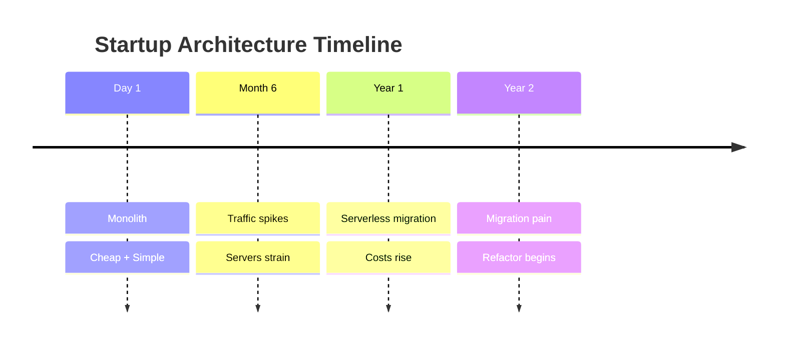
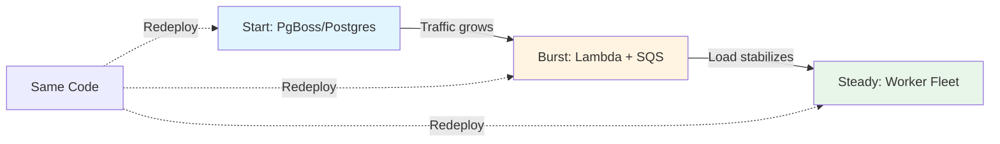
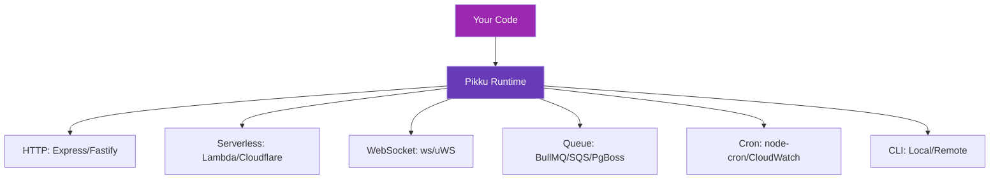

import Tabs from '@theme/Tabs';
import TabItem from '@theme/TabItem';
import CloudCostComparison from '@site/src/components/CloudCostComparison';
import CloudCostAtlas from '@site/src/components/CloudCostAtlas';

# Stop Locking Yourself In: The Real Cost of Choosing Too Early

Every architecture choice has a cost.
The wrong one just hides it longer.
**Pikku keeps your options open** — same code, any runtime, no rewrites.

---

## The Problem: Decisions That Age Badly

Teams over-optimize early — for scale, for cost, or for the trend of the day. Then scale shifts, costs spike, and refactors begin.



Research shows switching clouds or runtimes later can **double your spend** and **delay launches by months**. Yet most teams make these decisions when they have the least information.

---

## The Research Speaks

The academic and regulatory consensus is clear: vendor lock-in creates real technical and economic barriers.

<div style={{display: 'grid', gridTemplateColumns: 'repeat(auto-fit, minmax(300px, 1fr))', gap: '1.5rem', margin: '2rem 0'}}>

<div style={{border: '1px solid var(--ifm-color-emphasis-300)', borderRadius: '8px', padding: '1.5rem', backgroundColor: 'var(--ifm-background-surface-color)'}}>

### 40% Cost Reduction

> "Hybrid architectures can run at **40% of the cost** of single-cloud setups."

*— Skedulix, IEEE Cloud 2020*

Multi-cloud scheduling achieves significant cost savings by dynamically selecting optimal execution environments.

</div>

<div style={{border: '1px solid var(--ifm-color-emphasis-300)', borderRadius: '8px', padding: '1.5rem', backgroundColor: 'var(--ifm-background-surface-color)'}}>

### 85% Fewer Violations

> "Mixing VM-based and serverless resources cut SLA violations by **85%** and costs by **53%**."

*— LIBRA, 2021*

Hybrid deployments provide better reliability and cost efficiency than single-architecture approaches.

</div>

<div style={{border: '1px solid var(--ifm-color-emphasis-300)', borderRadius: '8px', padding: '1.5rem', backgroundColor: 'var(--ifm-background-surface-color)'}}>

### Substantial Barriers

> "Vendor lock-in … demands substantial effort to overcome existing barriers."

*— Opara-Martins et al.*

Technical and economic switching costs create long-term constraints on architectural evolution.

</div>

</div>

Even regulators agree: **egress fees** and **technical barriers** discourage switching. The UK Competition and Markets Authority (CMA, 2025) highlighted these as major concerns in cloud markets.

---

## Example: Scale Smoothly, Spend Wisely

Consider a queue-based background job system. Your needs change as you grow:



<Tabs groupId="queue-runtime">
<TabItem value="pgboss" label="🚀 Start Small" default>

```typescript
// Start with PgBoss - zero infrastructure overhead
import { PgBossQueue } from '@pikku/queue-pg-boss'

wireQueue({
  name: 'processUpload',
  queue: 'uploads',
  func: processUpload
})
```

**Best for:** MVP, low volume, simple setup
**Cost:** $0 extra (uses existing database)

</TabItem>

<TabItem value="lambda" label="⚡ Handle Spikes">

```typescript
// Same code, serverless execution
import { LambdaQueue } from '@pikku/aws-lambda'

wireQueue({
  name: 'processUpload',
  queue: 'uploads',
  func: processUpload
})
```

**Best for:** Unpredictable bursts, pay-per-use
**Cost:** Pay only when it runs

</TabItem>

<TabItem value="worker" label="📊 Optimize Steady Load">

```typescript
// Same code, dedicated workers
import { BullMQQueue } from '@pikku/queue-bullmq'

wireQueue({
  name: 'processUpload',
  queue: 'uploads',
  func: processUpload
})
```

**Best for:** Consistent high volume
**Cost:** Cheaper for always-on workloads

</TabItem>
</Tabs>

**The key insight:** Start small, scale serverlessly for bursts, then optimize for steady load when patterns emerge. Same code, different runtime. **No rewrites — just redeploy.**

<CloudCostComparison />

---

## Deep Dive: Explore Pricing Across Metrics

The chart above shows serverless function costs, but cloud pricing has many dimensions. Use the interactive atlas below to explore how providers compare across different metrics: egress fees, compute costs, queue operations, and free tiers.

<CloudCostAtlas />

---

## Architecture That Adapts

Pikku turns architecture into a **config**, not a **commitment**.



Write once, deploy anywhere — serverless today, fleet tomorrow, cloud-agnostic forever.

### What Pikku Abstracts

- **HTTP**: Express, Fastify, AWS Lambda, Cloudflare Workers, Next.js
- **WebSocket**: ws, uWebSockets.js, API Gateway, Durable Objects
- **Queues**: BullMQ, PgBoss, SQS, Cloud Tasks
- **Schedulers**: node-cron, CloudWatch Events, Cloudflare Cron
- **CLI**: Local terminal, WebSocket RPC, MCP tools

Each runtime provides the same interface, same middleware, same type safety. Your business logic stays pure.

---

## Keep the Cost of Changing Your Mind Near Zero

The real cost of lock-in isn't just money — it's **opportunity cost**. Every month spent rewriting for a new runtime is a month not spent building features.

### Pikku's Philosophy

1. **Write portable code by default** — No runtime-specific imports in your functions
2. **Choose your runtime at deploy time** — Not at write time
3. **Switch without rewrites** — Change config, not code
4. **Mix and match** — HTTP on Lambda, WebSockets on a server, queues on BullMQ

### Real-World Scenario

```typescript
// Day 1: Start on Express (simple)
import { ExpressRuntime } from '@pikku/express'
const runtime = new ExpressRuntime()

// Month 6: Add serverless HTTP for scale
import { LambdaRuntime } from '@pikku/aws-lambda'
const runtime = new LambdaRuntime()

// Year 1: Optimize costs with mixed approach
// HTTP on Lambda (bursty traffic)
// WebSockets on EC2 (stateful connections)
// Queues on BullMQ (predictable load)
```

Same functions. Same types. Same middleware. Different trade-offs.

---

## The Bottom Line

**Build once, run anywhere.**
**Keep the cost of changing your mind near zero.**

Modern applications need flexibility more than they need early optimization. Pikku gives you that flexibility without sacrificing type safety, developer experience, or performance.

### Get Started

- 📚 [Documentation](https://pikku.dev/docs)
- 🚀 [Quickstart Guide](https://pikku.dev/docs/quickstart)
- 💻 [GitHub](https://github.com/vramework/pikku)
- 💬 [Discussions](https://github.com/vramework/pikku/discussions)

### Further Reading

- **Research References:**
  - [Skedulix: Hybrid Cloud Scheduling](https://ieeexplore.ieee.org/document/9284312)
  - [LIBRA: Hybrid Serverless Computing](https://doi.org/10.1109/IC2E52221.2021.00027)
  - [Opara-Martins et al.: Vendor Lock-in](https://doi.org/10.1016/j.cose.2016.07.008)
  - [UK CMA Cloud Services Investigation 2024-2025](https://www.gov.uk/cma-cases/cloud-services)

---

**Stay Portable. Stay Profitable.**

Stop choosing too early. Start building for change.
